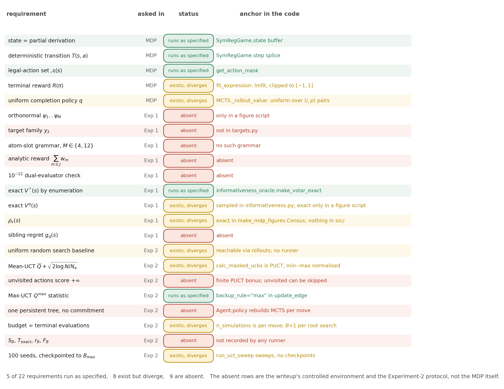
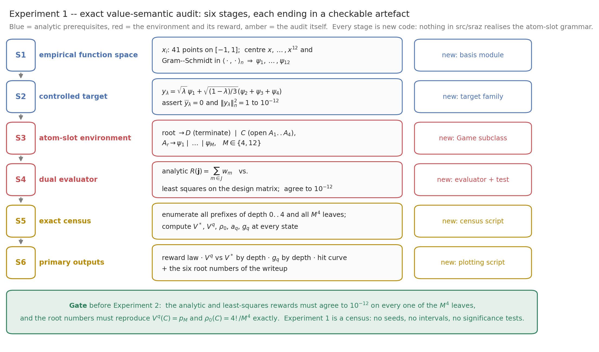
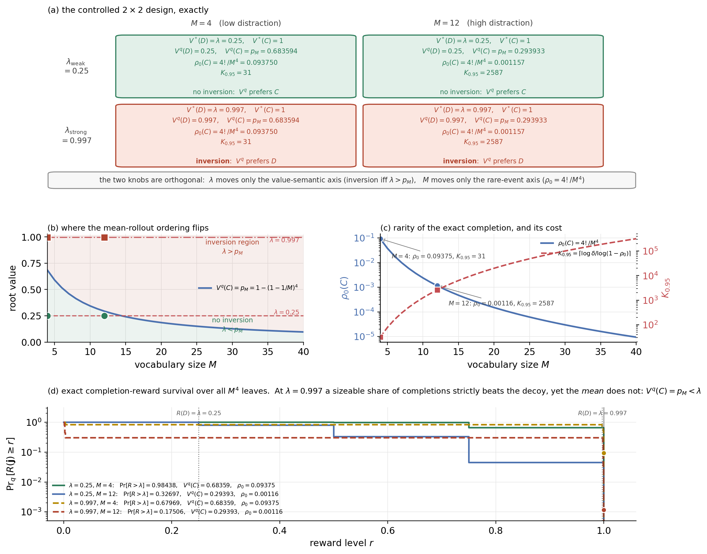

# The controlled pure-MCTS study against this codebase

What `writeup-milton/writeup.tex` specifies, what the repository already
realizes, and what has to be written. Every number quoted below was measured
in this repository at the commit this note was written against; nothing is
recalled from the writeup's own tables.



## 1. Verdict

Of the twenty-two requirements the writeup places on an implementation, five
run as specified, eight exist but diverge in a way that changes what is
measured, and nine are absent.

The split is not arbitrary. **The derivation MDP is already there.** State,
deterministic transition, legal-action set and terminal-reward-only structure
are exactly what the writeup assumes, and the two definitions the whole study
rests on — best-achievable value and mean-rollout value — are well posed on it
without modification.

**The controlled environment is not there, and cannot be reached by
configuration.** The four-slot atom grammar over an orthonormal basis is not a
grammar this game can be parameterized into, because the terminal evaluator
converts a token string to an infix expression and parses it symbolically. The
basis functions are numeric vectors produced by Gram–Schmidt; they have no
closed form to parse. Realizing the controlled family therefore needs a new
environment with a linear-algebra evaluator, not a new entry in the problem
registry.

**The Experiment-2 protocol is not there.** The selection rule is a different
formula from the one the writeup names, the search commits a move rather than
holding one persistent root, and none of the four outcome variables is
recorded.

There is a compensating discovery, and it is the most useful result in this
note: the phenomenon the controlled family is built to exhibit **already
occurs, exactly and reproducibly, in the shipped additive-quadratic
instance.** §3 gives the census.

## 2. The derivation MDP

The correspondence is exact for the first three rows and lossy for the rest.

| Formal object | Realization | Faithful? |
|---|---|---|
| state `s`: sentential form, `s₀ = S` | length-`L` integer buffer, right-padded, plus an occupied-slot count | yes |
| `A(s)`: legal actions | Boolean mask over `L · P` flattened `(position, production)` pairs | yes, but see below |
| `T(s,a)`: deterministic transition | in-place buffer splice | yes |
| `R(π)`: terminal reward | prefix → infix → symbolic parse → nonlinear fit of free constants → `R²`, clipped to `[-1,1]`; failure scores `-1` | range and estimator differ |
| `q(a|s) = 1/|A(s)|` | uniform over the flattened mask | measure differs |
| `V*(s)`, `V^q(s)` | well posed; `V*` computable by enumeration | yes |
| `ρ_ε(s)` | nothing computes it | absent |

Three departures matter.

**The derivation order is free.** The writeup's controlled grammar fills four
labelled slots, so a completion is a tuple and the uniform completion law
factorizes into four independent draws. Here the agent also chooses *which*
open nonterminal to rewrite, so `|A(s)|` tracks the number of open
nonterminals rather than being a constant. Measured on one episode of the
additive-quadratic instance at `L = 12`, the sequence is `4, 8, 12, 8, 4, 0`.
Consequently the closed forms `V^q(C) = 1 − (1 − 1/M)⁴` and `ρ₀ = 4!/M⁴` do
not transfer; both quantities must be obtained by recursion over sentential
forms.

**The reward lives on `[-1,1]`.** The clip is a guard: an unparseable or
singular expression would otherwise return a non-finite value and poison every
estimate that backs up through it. The cost is the identity that makes the
reward a variance share, and with it the calibration of the exploration
constant, which is the Hoeffding deviation for rewards on `[0,1]`.

**Constants are fitted nonlinearly.** Under the controlled grammar the model is
linear in its coefficients and the fit is an orthogonal projection. Here a
Levenberg–Marquardt solve runs from a fixed initialization under an evaluation
cap, so the reward is a property of the *oracle* as much as of the structure:
the same expression scores differently under different caps. The `10⁻¹²`
agreement the writeup demands between an analytic and a least-squares
evaluator is therefore a check against exact linear algebra, not against this
evaluator.

## 3. The writeup's phenomenon, already present

Enumerating every mask-reachable sentential form of the additive-quadratic
instance at `L = 12` — 4,898 of them, covering 405,781 terminal expressions —
gives the three primary quantities exactly, with no sampling.

| state | terminals below | `V*` | `V^q` | `ρ₀` |
|---|---:|---:|---:|---:|
| root `S` | 405,781 | 1.000000 | 0.629519 | 0.028212 |
| `S → + S S` (call it `C`) | 405,778 | 1.000000 | 0.885023 | 0.112847 |
| `S → * C1 x` (call it `D`) | 1 | 0.983104 | 0.983104 | 0 |
| `S → * C2 * x x` | 1 | 0.649947 | 0.649947 | 0 |
| `S → C0` | 1 | 0.000000 | 0.000000 | 0 |

This is a **value-semantic failure in the writeup's exact sense**:

```
V^q(D) = 0.983104  >  V^q(C) = 0.885023        (the mean-rollout ordering)
V*(D)  = 0.983104  <  V*(C)  = 1.000000        (the true ordering)
```

The one-term expression `C1·x` plays the strong decoy with an effective decoy
parameter of `0.983`, and it arises from the instance's own geometry rather
than being installed: on `x ∈ [1,3]` a quadratic with positive coefficients is
very nearly linear, so a structurally wrong one-term form captures 98.3% of the
variance. The writeup's `λ_strong = 0.997` is the same construction with the
value chosen instead of inherited.

Pure MCTS on this instance behaves as Hypothesis 2a predicts. From a single
persistent root with one completion per expanded leaf:

| budget `B` | terminal evals | visit share of `C` | visit share of `D` | `Q̄(s₀,C)` | `Q̄(s₀,D)` | best observed |
|---:|---:|---:|---:|---:|---:|---:|
| 8 | 9 | 0.875 | 0.000 | 0.709 | — | 0.998597 |
| 32 | 33 | 0.375 | 0.500 | 0.827 | 0.983 | 0.998597 |
| 128 | 129 | 0.250 | 0.680 | 0.929 | 0.983 | 0.998597 |

The allocation moves the wrong way as the budget grows: the branch containing
the optimum loses share monotonically while the decoy gains it, because the
exploitation statistic is converging to `V^q` and `V^q` prefers the decoy. The
best expression observed never reaches `1`, so simple regret stalls at
`0.001403` — small in reward, total in structure. That is precisely the
separation between predictive approximation and symbolic identification the
writeup's primary outcome is chosen to expose.

Two figures in the writeup now carry this: `figures/mdp_derivation.png` for the
census and `figures/mcts_expansion.png` for the search.

## 4. Experiment 1



| requirement | status |
|---|---|
| orthonormal `ψ₁…ψ_M` on the 41-point grid | exists only inside a figure script, not in the library |
| target family `y_λ` | absent; the target registry admits two- and three-coefficient polynomials only, so a four-component target is rejected on construction |
| atom-slot grammar with `M ∈ {4,12}` | absent, and unreachable by parameterization (§1) |
| analytic terminal reward as a coverage sum | absent |
| `10⁻¹²` dual-evaluator agreement | absent |
| exact `V*(s)` by enumeration | present and correct |
| exact `V^q(s)` | present only as the ad-hoc census written for the new figures; the library estimator samples |
| `ρ_ε(s)` | same |
| oracle sibling regret `g_q(s)` | absent |
| the four primary plots | absent |

The exhaustive-census claim holds comfortably: the largest environment has
`1 + 12 + 12² + 12³ + 12⁴ = 22,621` continue-prefix states, and the codebase
already enumerates 4,898 forms with 405,781 terminals in seconds under a far
more expensive evaluator.

One correction to the design, found while enumerating: `ρ₀ = 4!/M⁴` counts
permutations of four *distinct* atoms, so it is a probability only for `M ≥ 4`.
At smaller vocabularies the four target atoms cannot all be selected and the
exact mass is zero. This does not affect the two cells the writeup uses.

## 5. Experiment 2

### The selection rule is a different formula

The writeup's Mean-UCT is

```
a_t = argmax_a [ Q̄_t(s,a) + sqrt( 2 log N_t(s) / N_t(s,a) ) ],   unvisited a scores +∞
```

The implemented rule is

```
a_t = argmax_a [ (Q(s,a) − q_min) / (q_max − q_min)  +  c · P(a) · sqrt(N(s) + ε) / (1 + N(s,a)) ]
```

with `c = 1`, `P` the mask-renormalized uniform prior, `ε = 10⁻⁸`, and
`q_min, q_max` the running extremes of backed-up edge values over the current
search. Four consequences:

1. **The bonus has the AlphaZero shape, not the UCT shape.** `sqrt(N)/(1+N_a)`
   decays faster in `N_a` and grows faster in `N` than `sqrt(log N / N_a)`.
2. **The prior divides the bonus by the branching factor.** After
   renormalization `P(a) = 1/|A(s)|`, so exploration is damped exactly where
   the tree is widest — the opposite of what the rare-event hypothesis needs.
3. **Unvisited actions do not score `+∞`.** They receive a finite bonus and can
   be starved. Measured: at `B = 8` with four legal root actions, only two are
   ever visited. Under the writeup's rule all four would be tried in the first
   four simulations.
4. **Min–max normalization is a confound for the mean-versus-max contrast.**
   The exploitation term is rescaled by the observed spread of `Q`, and that
   spread differs systematically between mean and maximum backup. The two
   conditions are therefore *not* compared at matched exploration, which is
   what Hypothesis 2c requires. Additionally `q_min, q_max` are reset per
   search and start at `±∞`, so the first descent of every search sees a
   uniformly zero exploitation term and is decided by index order.

The maximum-backup half of the diagnostic is faithful: the edge statistic
under `backup_rule="max"` is exactly the maximum of the returns backed up
through that edge.

### The protocol diverges

| requirement | status |
|---|---|
| one persistent tree at `s₀`, no action committed | the agent constructs a **fresh** search tree on every move, so the shipped evaluation is a sequence of independent root searches, not one |
| budget = terminal evaluations | the knob is simulations *per move*. For a single persistent root search at one completion per leaf the two agree up to `+1` (measured: `B = 64` → 65 evaluations). At the shipped `rollout_n = 20` they do not |
| `R^max_B`, `S_B`, `T_exact`, `r_B`, `F_B` | none recorded. The best-observed reward is not even recoverable after the fact, because rollout leaves are evaluated on a clone whose memo table is discarded |
| 100 seeds, one run to `B_max` with intermediate checkpoints | the sweep re-runs from scratch per budget |
| uniform random search baseline | reachable by driving completions directly; no runner exists |
| no reward clipping, no complexity penalty, no nonlinear optimizer | clipping and a nonlinear optimizer are both in the terminal evaluator |

### Operational hazards

- **The shared rollout budget silently truncates.** It is spent in rollout
  *steps* and reset per search, and its default is 500. Measured at
  `n_simulations = 64, rollout_n = 20`: the default cut terminal evaluations
  from 217 to 173. At `B = 8192` the truncation would dominate the result. The
  existing sweep script already raises it to 20,000 and says so; the pure-MCTS
  evaluation script does not raise it at all.
- **Terminal rewards are memoized per expression string.** A repeated
  expression consumes a simulation but not a fit. Budget accounting must
  therefore count *evaluations requested*, not fits performed.
- **The token budget decides whether the optimum exists.** The mask test is
  strict, so a finished expression holds at most `L − 1` tokens. The exact
  three-term additive expression needs 11, so `V*(s₀) = 1` at `L = 12` and
  `V*(s₀) = 0.998597` at `L = 11`. The exact-recovery outcome is meaningless
  unless `L` is checked first.

## 6. What runs today

```bash
# exact census + the two new writeup figures (real environment, real search)
python writeup-milton/figures/make_mdp_figures.py

# design visualisations for Experiment 1 (analytic; validates the closed forms)
python Claude-milton-experiments/figures/make_design_figures.py

# exact V* by enumeration on the shipped instances
python scripts/analysis/informativeness_oracle.py --max-len 11 \
    --problems additive_quadratic sine

# net-free MCTS as a fixed search procedure, K independent episodes
python scripts/run/eval_pure_mcts.py --problem additive_quadratic \
    --eval-episodes 20 --n-simulations 100 --rollout-n 30 --max-len 12

# budget x backup-rule sweep over a target family
python scripts/run/run_uct_sweep.py --family quadratic \
    --backup-rules mean max --n-simulations 4 8 16 32 \
    --rollout-n 5 --rollout-budget 20000

python -m pytest tests/ -q        # 359 passed
```

The design figures double as a check on the writeup's own table: enumerating
all `M⁴` completions reproduces `V^q(C) = p_M` and `ρ₀(C) = 4!/M⁴` to printed
precision in all four cells, and confirms `K₀.₉₅ = 31` and `2587`.



A detail worth keeping: at `λ = 0.997, M = 12` a full 17.5% of uniform
completions score *strictly above* the decoy, yet the mean sits at `0.294`,
far below the decoy's `0.997`. The failure is not that good completions are
absent from the continue branch — it is that averaging discards them. That is
the sharpest available statement of why the exploitation statistic is the
target of the study.

## 7. Source map

| Object | Path |
|---|---|
| derivation MDP and terminal evaluator | `src/sraz/instances/symreg/game.py` |
| named instances (grammar + target pairs) | `src/sraz/instances/symreg/problems.py` |
| fixed target families | `src/sraz/instances/symreg/targets.py` |
| run configuration, net-free switch | `src/sraz/instances/symreg/config.py` |
| search: selection, rollout, backup | `src/sraz/core/mcts.py` |
| uniform prior with constant value | `src/sraz/core/policy_value_net.py` |
| per-move search construction | `src/sraz/core/agent.py` |
| exact `V*` by enumeration | `scripts/analysis/informativeness_oracle.py` |
| sampled rollout statistics | `scripts/analysis/informativeness.py` |
| net-free evaluation driver | `scripts/run/eval_pure_mcts.py` |
| budget × backup-rule sweep | `scripts/run/run_uct_sweep.py` |
| exact census, new figures | `writeup-milton/figures/make_mdp_figures.py` |
| controlled-scenario figures | `writeup-milton/figures/make_scenario_figures.py` |
| design visualisations | `Claude-milton-experiments/figures/make_design_figures.py` |
