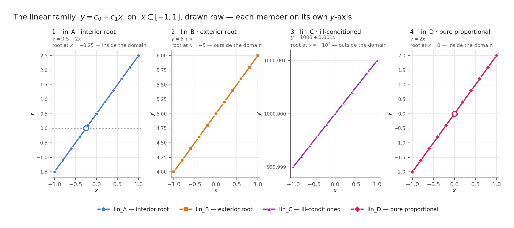
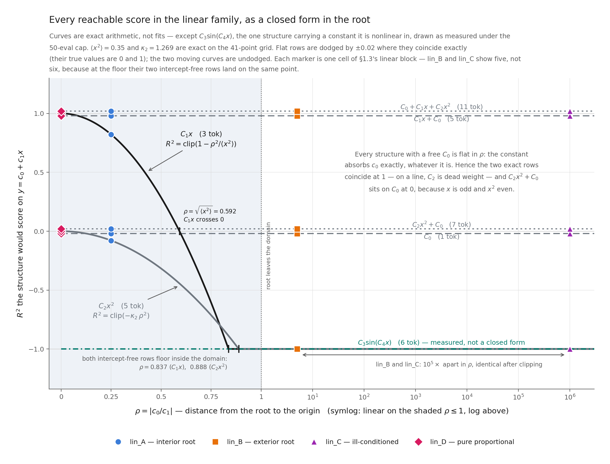
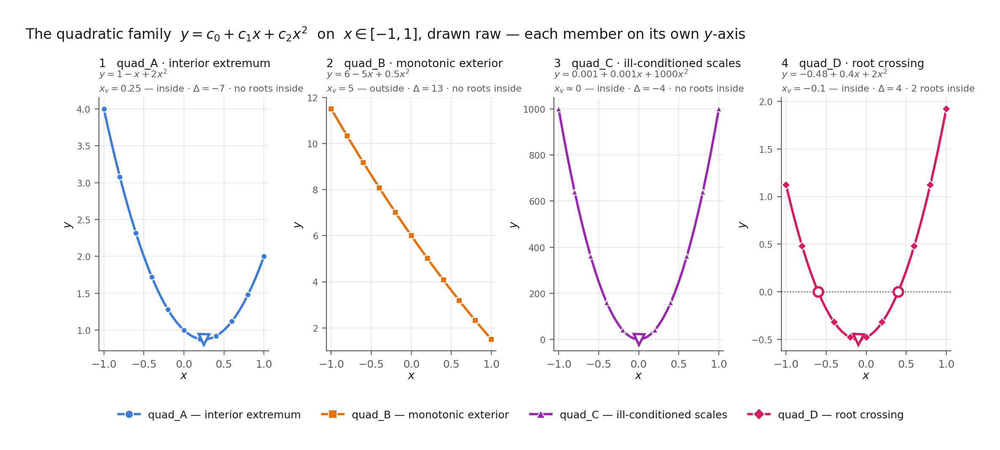
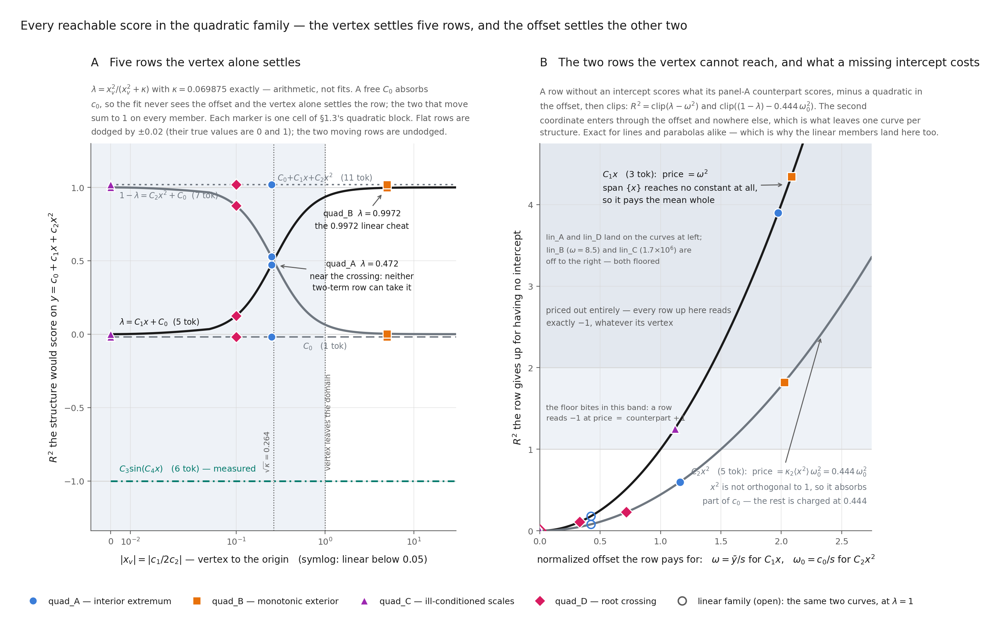

# Target families for the grammar game

## Table of contents

- [1. Target families](#1-target-families)
  - [1.1 The linear family](#11-the-linear-family)
  - [1.2 The quadratic family](#12-the-quadratic-family)
  - [1.3 The reachable-score ladder](#13-the-reachable-score-ladder)
- [2. Pure MCTS against the simulation budget](#2-pure-mcts-against-the-simulation-budget)
  - [2.1 What is switched off](#21-what-is-switched-off)
  - [2.2 The measurement](#22-the-measurement)
  - [2.3 Why the constant wins](#23-why-the-constant-wins)
- [Appendix: Source map](#appendix-source-map)
- [Appendix: Reproduce](#appendix-reproduce)

## 1. Target families

> **Goal.** Define eight hidden functions whose shapes are known rather than sampled.

Sampling $c_i \sim \mathcal N(0,1)$ tests the search against whatever shape the draw happens to produce. Fixing the coefficients instead partitions the function space by geometric invariants taken *relative to the data domain*, so each family member is a topologically distinct shape and a failure can be attributed to a property rather than to luck.

Both families are scored by the same seven-production grammar, sinusoid included. The sinusoid is a **distractor** here: no member needs it, and it scores $-1$ against every one of the eight (its fit fails outright), so a search that reaches for it is buying nothing.

### 1.1 The linear family

$$y = c_0 + c_1 x, \qquad x \in [-1,1].$$

A line has no vertex and no discriminant. The only invariants available are where its root sits relative to the domain, and how its two coefficients are scaled against one another.

| Target | Name | $(c_0, c_1)$ | root | Design intent |
|---|---|---|---|---|
| `lin_A` | interior root | $(0.5,\ 2.0)$ | $-0.25$, interior | the balanced case; both coefficients $O(1)$ |
| `lin_B` | exterior root | $(5.0,\ 1.0)$ | $-5$, exterior | offset dominates; the curve never approaches $0$ on the domain |
| `lin_C` | ill-conditioned | $(1000,\ 0.001)$ | exterior | ill-conditioned: $c_0/c_1 = 10^6$ |
| `lin_D` | pure proportional | $(0.0,\ 2.0)$ | $0$ | exactly the 3-token `* C1 x` |

> **What this figure shows** The four members drawn raw, each on its own axis.



**Figure 1a: The linear family, drawn raw.** *Read.* Each member on its own $y$-axis, roots inside the domain ringed. Deterministic — no seed, no search.

| Reading | Statement |
|---|---|
| Literal | Four raw lines over $x\in[-1,1]$. Panels 1 and 4 ring a root inside the domain; panels 2 and 3 have none to ring. |
| Math/Comp | Nothing is computed here beyond evaluating each member on the 41-point grid. |
| Interp | The four shapes a line can take relative to this domain, which is all the shapes there are: the root is inside, outside, or at the origin, and the coefficients are balanced or not. |

Per-member axes are not a presentational retreat. The reward is exactly invariant to $y \mapsto ay$ but not to $y \mapsto y + b$, and the $10^6$ spread these members are built around lives in the **offset** — so the one normalization that would put them on a shared axis is the one that destroys them. Z-scoring makes the point sharply: every non-degenerate line is the *same* line once shifted and scaled, so a z-scored panel draws `lin_A`–`lin_D` as a single curve and claims to have shown four. Both facts are asserted by test, not asserted here.

One design intent reads differently once drawn. The ill-conditioned member is not merely awkward to fit — on this domain it *is* a constant, varying by $2\times10^{-6}$ about $1000$, which is why panel 3 needs six decimals to show a slope at all.

> **What this figure shows** What every candidate structure would score against this family, as a closed form in the root.



**Figure 1b: Every reachable score in the linear family, as a closed form in the root.** *Read.* Six of the seven curves are exact arithmetic, not measurements; the sinusoid alone is measured, because it is the one structure no closed form reaches. Deterministic — no seed, no search.

| Reading | Statement |
|---|---|
| Literal | $R^2$ of each of the seven ladder structures against $\rho = \lvert c_0/c_1\rvert$ (symlog $x$: linear on the shaded $\rho \le 1$, log above). Each member contributes one marker per curve, so the markers **are** §1.3's linear block. Two curves fall; five are flat across six decades. |
| Math/Comp | On the symmetric grid $\langle x\rangle = \langle x^3\rangle = 0$, so $y - \bar y = c_1x$ and the offset $c_0$ is the only thing a structure can be made to pay for. A free $C_0$ absorbs it exactly, whatever it is — hence five flat rows, at $0, 1, 0, 1$ and (measured) $-1$. The two intercept-free rows cannot: `* C1 x` gives $\mathrm{clip}(1 - \rho^2/\langle x^2\rangle)$, and `* C2 * x x` gives $\mathrm{clip}(-\kappa_2\rho^2)$ with $\kappa_2 = (1 - \langle x^2\rangle^2/\langle x^4\rangle)/\langle x^2\rangle = 1.269$. Both $\langle x^2\rangle = 0.35$ and $\langle x^4\rangle = 0.220325$ are exact. |
| Interp | The family has one degree of freedom the reward can see, and $\rho$ moves exactly the two rows that lack an intercept. Everything else the reward can say about a line is settled before $\rho$ is chosen. |

**The reward goes blind before the root leaves the domain.** Both falling rows reach the clip floor while the root is still inside $[-1,1]$ — `* C1 x` at $\rho = 0.837$, `* C2 * x x` at $\rho = 0.888$ — and `* C1 x` has already crossed $0$ at $\rho = 0.592$. Past $\rho \approx 0.89$ the two intercept-free structures are indistinguishable from each other *and* from the sinusoid, all three pinned at $-1$. This is why the exterior-root and ill-conditioned members score identically despite sitting $10^5$ apart in $\rho$: §1.3's "clipping hides ordering" is not a table artifact but a property of the curve, and it bites well inside the design space.

**Two coincidences worth naming.** The 11-token three-term quadratic and the 5-token line both score exactly $1$ at every $\rho$: on a linear target $C_2$ is six tokens of dead weight, so §1.3's universal exact structure is universal but never *cheapest*. And `C_2x^2 + C_0` lies exactly on `C_0` at $0$ — a quadratic term added to a constant buys precisely nothing, because $x$ is odd and $x^2$ even, so the term cannot reach the residual it would need to. Both coincidences are the same fact as the flat rows, read the other way: what the reward cannot see, it cannot charge for either.

### 1.2 The quadratic family

$$y = c_0 + c_1 x + c_2 x^2, \qquad x \in [-1,1],$$

partitioned by the vertex $x_v = -c_1/2c_2$ and the discriminant $\Delta = c_1^2 - 4c_0c_2$.

| Target | Name | $(c_0, c_1, c_2)$ | $x_v$ | $\Delta$ | Roots in domain | Design intent |
|---|---|---|---|---|---|---|
| `quad_A` | interior extremum | $(1,\ -1,\ 2)$ | $0.25$, interior | $-7$ | none | a genuine turnaround forbids a linear cheat |
| `quad_B` | monotonic exterior | $(6,\ -5,\ 0.5)$ | $5$, exterior | $13$ | none | monotonic and sign-stable: looks like a line |
| `quad_C` | ill-conditioned scales | $(0.001,\ 0.001,\ 1000)$ | $\approx 0$, interior | $-4$ | none | ill-conditioned: $c_2/c_1 = 10^6$ |
| `quad_D` | root crossing | $(-0.48,\ 0.4,\ 2)$ | $-0.1$, interior | $4$ | $-0.6,\ 0.4$ | the curve passes through $y = 0$ |

No two of these share a $(\text{vertex inside},\ \text{roots inside},\ \text{monotonic})$ signature except the interior-extremum and ill-conditioned members, which the $10^6$ scale ratio separates instead. This is asserted by test, because a family that fails to partition is four arbitrary parabolas.

Two coefficients are load-bearing against the partition rather than free. The monotonic-exterior target needs $c_0 = 6$ to keep both roots outside the domain — the natural $(1,-5,0.5)$ leaves one at $x = 0.204$, which would make it a sign-changing curve and collide with the root-crossing member. The root-crossing target needs *asymmetric* roots at $-0.6$ and $0.4$: symmetric roots force $c_1 = 0$, and a target with no linear term is fitted exactly by the 7-token `+ * C2 * x x C0`, which would make it strictly easier than the interior-extremum member while purporting to be harder.

> **What this figure shows** The four members drawn raw.



**Figure 2a: The quadratic family, drawn raw.** *Read.* Each member on its own $y$-axis, roots inside the domain ringed and the vertex marked wherever it lies inside. Deterministic — no seed, no search.

| Reading | Statement |
|---|---|
| Literal | Four raw parabolas over $x\in[-1,1]$. Panel 4 rings two roots; panels 1–3 have none to ring. Panels 1, 3 and 4 mark a vertex inside the domain; panel 2's sits at $x_v = 5$, far off the axis. |
| Math/Comp | Nothing is computed here beyond evaluating each member on the 41-point grid. |
| Interp | §1.2's partition made visible: vertex inside or outside, roots inside or not — and, for the one pair those two invariants fail to separate, a $10^6$ scale ratio instead. |

Per-member axes are the same choice §1.1 defends, for the same reason: the reward is exactly invariant to $y \mapsto ay$ but not to $y \mapsto y+b$. Panel 2 rewards reading against its own label. Over this domain the monotonic-exterior member simply *looks like a line* — which is not a drawing artifact but the trap it was built to set, and §1.3 measures how deep.

> **What this figure shows** What every candidate structure would score against this family: five rows as a closed form in the vertex, and the two that the vertex cannot reach, priced against the offset.



**Figure 2b: Every reachable score in the quadratic family, in the two invariants that set it.** *Read.* Two panels, because this family has two reward-visible degrees of freedom and no single axis holds all seven rows honestly. Six of the seven curves are exact arithmetic; the sinusoid alone is measured. Deterministic — no seed, no search.

| Reading | Statement |
|---|---|
| Literal | Panel A: $R^2$ of the five rows the vertex settles, against $\lvert x_v\rvert$ (symlog). Panel B: what the two intercept-free rows *give up* for having no constant, against their own normalized offset. Every marker is one cell of §1.3's quadratic block; the linear family's members (open) land on panel B's same two curves. |
| Math/Comp | On the symmetric grid $x \perp 1$ and $x \perp (x^2 - \langle x^2\rangle)$, so the variance splits: $s^2 = c_1^2\langle x^2\rangle + c_2^2V$ with $V = \langle x^4\rangle - \langle x^2\rangle^2$. The linear share $\lambda = x_v^2/(x_v^2+\kappa)$, $\kappa = 0.069875$ exactly, is a closed form in the vertex alone — the member's scale divides out. A free $C_0$ absorbs $c_0$, so the five rows carrying one are settled by $\lambda$: they score $0$, $\lambda$, $1-\lambda$, $1$, and (measured) $-1$. The two without one must pay for an offset $x_v$ cannot see: `* C1 x` scores $\mathrm{clip}(\lambda - \omega^2)$ with $\omega = \bar y/s$, and `* C2 * x x` scores $\mathrm{clip}((1-\lambda) - \kappa_2\langle x^2\rangle\,\omega_0^2)$ with $\omega_0 = c_0/s$ and $\kappa_2\langle x^2\rangle = 0.444$. |
| Interp | The two invariants §1.2 partitions by *are* the reward's two degrees of freedom. The vertex settles every row that carries an intercept; the offset settles the two that do not — and it settles them as a **price**, each scoring what its intercept-carrying counterpart scores, minus a quadratic. |

**Why two panels rather than 1b's seven curves.** Hold the vertex at $x_v = 0.25$ and slide the offset alone: `C1x + C0` and `C2x² + C0` do not move by so much as $10^{-6}$, while `C1x` swings from $-0.19$ to the clip floor. A seventh curve against $\lvert x_v\rvert$ would assert a function that does not exist. The linear family could afford one axis because $\rho$ is its only reward-visible freedom; this one cannot, and the second coordinate is the discriminant in disguise — $\Delta = -4c_2\,y(x_v)$, so the offset *is* the vertex's height.

**The middle rows are predictions, not observations.** $\lambda$ at $x_v = 0.25,\ 5,\ \approx 0,\ -0.1$ is $0.472,\ 0.997,\ 0.000,\ 0.125$, which is §1.3's `C1x + C0` row exactly, and $1-\lambda$ is its `C2x^2 + C0` row. The interior-extremum member sits near the crossing at $\lvert x_v\rvert = \sqrt{\kappa} = 0.264$, which is why its variance divides almost evenly and why neither two-term structure can take it.

**The trap depth is a design parameter, not a discovery.** The monotonic-exterior member's $0.9972$ linear cheat is $\lambda(x_v = 5)$ — forced the moment its vertex was placed at $5$. Pushing the vertex further out drives $\lambda \to 1$ and deepens the trap; pulling it toward $\sqrt{\kappa}$ removes it. The deception is set here, in §1.2, by one coefficient ratio.

**Figures 1b and 2b draw one law, not two.** Put $\lambda = 1$ — that is, $c_2 = 0$, a line — and panel B's two curves collapse onto Figure 1b's two falling ones exactly: $\omega^2 = \rho^2/\langle x^2\rangle$ and $\kappa_2\langle x^2\rangle\,\omega_0^2 = \kappa_2\rho^2$. **Figure 1b is the $\lambda = 1$ slice of Figure 2b's panel B**, which is why the linear members can be drawn on it at all. What read as two families' worth of separate arithmetic is one sentence: *a structure without an intercept scores what its intercept-carrying counterpart scores, minus a quadratic in the normalized offset, then clips.* The two rows differ only in the rate — `C1x` pays the whole offset, `C2x²` pays $0.444$ of it, because $x^2$ is not orthogonal to $1$ and can absorb some of a constant where $x$ can absorb none. Asserted by test on both families and on a hundred-odd random lines and parabolas, not by these figures.

### 1.3 The reachable-score ladder

Every value measured through the reward pipeline under a 50-evaluation cap, deterministic. No entry here is a number the table alone carries: the four `lin_*` columns are Figure 1b read off at four values of $\rho$, and the four `quad_*` columns are Figure 2b read off at four vertices — panel A for the five rows the vertex settles, panel B for the two it does not. The table is the figures, tabulated.

| structure | tokens | `lin_A` | `lin_B` | `lin_C` | `lin_D` | `quad_A` | `quad_B` | `quad_C` | `quad_D` |
|---|---|---|---|---|---|---|---|---|---|
| $C_0$ | 1 | $0.000$ | $0.000$ | $0.000$ | $0.000$ | $0.000$ | $0.000$ | $0.000$ | $0.000$ |
| $C_1x$ | 3 | $0.821$ | $-1.000$ | $-1.000$ | $\mathbf{1.000}$ | $-1.000$ | $-1.000$ | $-1.000$ | $0.017$ |
| $C_2x^2$ | 5 | $-0.079$ | $-1.000$ | $-1.000$ | $-0.000$ | $-0.071$ | $-1.000$ | $\mathbf{1.000}$ | $0.646$ |
| $C_1x + C_0$ | 5 | $\mathbf{1.000}$ | $\mathbf{1.000}$ | $\mathbf{1.000}$ | $\mathbf{1.000}$ | $0.472$ | $0.997$ | $0.000$ | $0.125$ |
| $C_2x^2 + C_0$ | 7 | $-0.000$ | $0.000$ | $-0.000$ | $0.000$ | $0.528$ | $0.003$ | $\mathbf{1.000}$ | $0.875$ |
| $C_0 + C_1x + C_2x^2$ | 11 | $\mathbf{1.000}$ | $\mathbf{1.000}$ | $\mathbf{1.000}$ | $\mathbf{1.000}$ | $\mathbf{1.000}$ | $\mathbf{1.000}$ | $\mathbf{1.000}$ | $\mathbf{1.000}$ |
| $C_3\sin(C_4x)$ | 6 | $-1.000$ | $-1.000$ | $-1.000$ | $-1.000$ | $-1.000$ | $-1.000$ | $-1.000$ | $-1.000$ |

**The 11-token three-term quadratic scores $1$ on all eight.** It is the universal exact structure, and it fits comfortably under the 14-token cap. Unlike the first note's instance — where the generating form needed 18 tokens and a perfect fit was *unreachable* — every target here is exactly expressible, so $R^2 = 1$ is a real ceiling rather than an aspiration.

**The monotonic-exterior target sets its trap as designed.** A purely linear derivation explains $99.7\%$ of it. The remaining $0.3\%$ is the entire signal distinguishing a 5-token local optimum from an 11-token global one, and whether a search notices is exactly the sensitivity question that member was built to ask.

**Clipping hides ordering.** Many entries sit at exactly $-1.000$, the clip floor, where structures of very different badness become indistinguishable. A search cannot gradient its way out of a plateau it cannot see across. Figure 1b puts a number on where this starts for the linear family: $\rho \approx 0.89$, with the root still well inside the domain. Figure 2b's panel B says where it starts in general — a row floors once its price reaches its counterpart's score plus $1$, and since every counterpart lies in $[0,1]$, the floor always bites at a price between $1$ and $2$, whatever the target.

## 2. Pure MCTS against the simulation budget

> **Goal.** Spend the ladder of §1.3 on the simplest search that can play the game, and read what the budget buys.

### 2.1 What is switched off

The experiment is defined by its subtractions. Everything that could learn, remember, or explore off-policy is disabled, leaving three moving parts: a uniform prior over the legal productions, a leaf value that is the mean of five random completions, and a visit-count argmax at each move. An emitted expression is then a function of the simulation budget and the rollout draws alone.

| Knob | Value | Why this value makes the experiment simple |
|---|---|---|
| network | uniform prior, value $0$ | nothing is learned, so no training curve can confound the budget |
| $N_{\text{sim}}$ | $5, 9, 13, 17$ | the swept axis: $5$–$20$ in steps of $4$ ($21$ would leave the range) |
| targets | `lin_D`, `quad_B` | one panel each: the exactly-reachable case and the deceptive one (§1.1–1.2) |
| leaf value | mean of $5$ random rollouts | the only estimator; `rollout_blend` $=0$ so the net's $0$ never mixes in |
| episodes | $5$ per cell | repeats over the rollout draws (**but see the reproducibility warning in §2.2**) |
| backup rule | `mean` | one rule; the mean-vs-max comparison is a separate question |
| $c_{\text{exploration}}$ | $1.0$ | the UCB constant, held fixed |
| $\tau$ | $1.0$ in search, $0$ at selection | argmax over visit counts: no sampling noise on top of the rollouts |
| Dirichlet noise | off | no root exploration noise |
| `rollout_budget` | $10^6$ | set so it never binds; at $500$ it silently starves leaves past the seventh |
| `lmfit_max_nfev` | $50$ | the §1.3 ladder's cap, so the reachable scores are the ones tabulated there |
| trainer | none | with the network disabled an iteration would batch episodes and propagate nothing |

Two of these are load-bearing rather than cosmetic. **The rollout budget must not bind**: at the default $500$ steps, five rollouts per leaf exhaust it after roughly seven leaf expansions, and further leaves fall back to the network's $0$ — which is a *different estimator*, silently swapped in mid-search. And **rollouts are the only intended randomness**: with `rollout_n` $=0$ the search consults no RNG at all and every episode is identical (`test_uct_pure_search.py`), which is what the five repeats are here to exercise.

> **Reproducibility warning — this section's numbers are provisional.** Turning rollouts on makes the search **not reproducible under a fixed seed**. Seeding the global numpy RNG and replaying the same episode three times in one process yields *three different sentences*. This is not the intended rollout noise: it defeats seeding altogether, so the five repeats do not measure what §2.1 says they measure, and no cell below can be re-derived exactly. The cause is isolated to `MCTS._rollout_value` — a hand-written loop over the same `Game` API (`clone` / `get_action_mask` / `step_wrapper`) with the same seed *is* deterministic, and the fits, the fit cache, hash randomisation and BLAS threading have each been ruled out by measurement. Until that is fixed, read §2.2's **shape** and not its digits.

### 2.2 The measurement

> **What this figure shows** Greedy $R^2$ against the simulation budget on both targets (row A), and the root-edge $Q$ that decides each curve (row B).


**Figure 3: Pure MCTS with mean random-rollout leaves.** *Read.* Row A: five episodes per budget, drawn individually behind their mean. Row B: the backed-up $Q$ on each root edge after $9$ simulations, in grammar order, shaded where the visit-count argmax lands.

| Reading | Statement |
|---|---|
| Literal | A1: `lin_D` sits at $R^2 = 1.0000$ at every budget, spread zero. A2: `quad_B` reads $+0.9978$ at $5$ simulations and exactly $0.0000$ at $9$, $13$, $17$. B1: `lin_D`'s `* C1 x` edge holds $Q = +1.00$ with $N = 7$; three edges are never visited. B2: `quad_B`'s `C0` edge holds $Q = +0.00$ with $N = 3$ and is the **largest** $Q$ at the root; every other edge is negative. |
| Math/Comp | On `quad_B` the mean of five random completions is negative on every continuing branch ($-0.60$ to $-1.00$), because the grammar's reachable structures are dominated by the $-1$ clip floor (§1.3). Terminating immediately via `S -> C0` scores exactly $0$. Since $0 > -0.60$, UCT ranks doing nothing above every continuation. |
| Interp | More search makes the emitted expression **worse**, and the search is not malfunctioning — it is correctly optimising a leaf estimator that says every road forward is bad. |

What survives re-running is the **shape**, not the digits. Across repeated runs of the identical command, `lin_D` stays pinned at $1.0000$; `quad_B` stays in the $0.997$–$1.000$ band below $8$ simulations and drops to the $C_0$ constant at $8$ and above. The per-cell means wobble — `quad_B`'s low-budget cells move between $0.9972$ and $1.0000$ as episodes land on different sentences of the same score class, and a high-budget cell occasionally shows one episode escaping to $1.0$. Those wobbles are the reproducibility defect above, not a measured effect, and nothing in §2.3 rests on them.

### 2.3 Why the constant wins

**`lin_D` is a control, not a measurement.** Its exact structure `* C1 x` is one production from the root and *terminal*, so the first simulation to try it backs up $Q = +1.00$ and no budget can do better. Three of the seven productions are never visited at all. A budget sweep on `lin_D` cannot show anything, which is worth stating rather than presenting a flat line as a result.

**`quad_B`'s pre-collapse point is a tie-break, not a success.** The grammar has **seven** productions, so a budget below $8$ cannot give any root edge a second visit: every edge that has been tried carries $N = 1$, the visit counts are tied, and `np.argmax` resolves the tie at the lowest flat index — production $0$, `S -> + S S`. That edge continues the derivation, and the episode lands on some bloated spelling of $C_1x + C_0$, the $0.9972$ linear cheat §1.2 built into the target. *Which* spelling varies from run to run; that it reduces to the linear cheat does not. Search did not find that structure — the tie-break did, and reporting the resulting $\approx 0.998$ as search succeeding at a low budget would read the figure exactly backwards.

**The flip sits at $N_{\text{sim}} = 8 = 7 + 1$**, measured on a finer $1..17$ grid: $8$ is the first budget at which some edge gets a second visit, and it goes to `C0` because `C0` holds the largest $Q$. From there the argmax stays on `C0` and the episode emits the constant, with $N(\texttt{C0})$ growing $2 \to 3 \to 7 \to 11$ as the budget goes $8 \to 9 \to 13 \to 17$. The threshold is set by the size of the production set, not by anything about `quad_B`.

The collapse is therefore not a plumbing bug but the estimator working as specified: **mean-aggregating rollouts over a grammar whose structures mostly hit the clip floor makes every continuation look worse than quitting.** Below the threshold the search is not yet acting on that belief; above it, it is.

This is a property of the aggregation, not of rollouts. The `mean`/`max` split is already visible in this repo's earlier `quad_A` data, where $5$ averaged rollouts decay from $0.546$ to $0.165$ as the budget goes $5 \to 20$ while $5$ best-of rollouts hold near $1.0$. Drawing the averaged arm alone — as §2 does, by construction — reports that rollouts make search worse. That is true, and on its own it is misleading.

## Appendix: Source map

| Topic | Source |
|---|---|
| Target families and their invariants | [targets.py](../../src/sraz/instances/symreg/targets.py) |
| Pure-MCTS sweep driver (§2) | [run_pure_mcts_targets.py](../../scripts/run/run_pure_mcts_targets.py) |
| Figure 3 driver (§2) | [plot_pure_mcts_targets.py](../../scripts/plotting/plot_pure_mcts_targets.py) |
| Rollout leaf evaluation and the shared budget | [mcts.py:297-339](../../src/sraz/core/mcts.py#L297-L339) |
| Rollouts draw from the global numpy RNG | [mcts.py:322](../../src/sraz/core/mcts.py#L322) |
| Greedy (τ=0, noise-free) episode | [evaluate.py](../../src/sraz/instances/symreg/evaluate.py) |
| Fixed-target mode, domain, optimizer cap | [game.py:188-227](../../src/sraz/instances/symreg/game.py#L188-L227) |
| Inner optimizer cap plumbed to lmfit | [game.py:131-172](../../src/sraz/instances/symreg/game.py#L131-L172) |
| Figures 1a, 1b, 2a and 2b | [plot_target_families.py](../../scripts/plotting/plot_target_families.py) |
| Family geometry and ladder tests | [test_symreg_targets.py](../../tests/test_symreg_targets.py) |

## Appendix: Reproduce

```bash
# from repo root

# Figures 1a, 1b, 2a and 2b: the two families and the closed forms that score them
python scripts/plotting/plot_target_families.py

# every claim above that is pinned by a test
python -m pytest tests/test_symreg_targets.py -q

# Section 2: the pure-MCTS sweep, then Figure 3.
# NOTE: the sweep is NOT reproducible run-to-run -- see the warning in 2.1.
# The shape (lin_D pinned at 1.0; quad_B flipping to the constant at 8
# simulations) repeats; the per-cell digits do not.
python scripts/run/run_pure_mcts_targets.py
python scripts/plotting/plot_pure_mcts_targets.py

# the finer grid that locates the flip at N_sim = 8 = 7 productions + 1
python scripts/run/run_pure_mcts_targets.py \
    --n-simulations 1 2 3 4 5 6 7 8 9 13 17 --out /tmp/fine_grid.json
```
