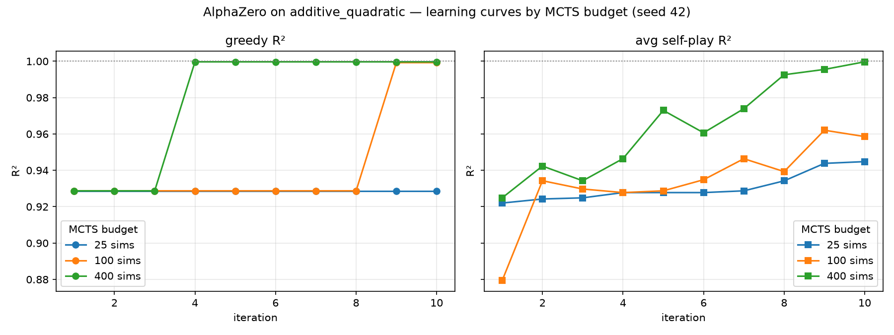

# Additive instance — build + first AlphaZero results

*Snapshot, 2026-07-15. First experiment under the informativeness × deception
framework ([02](02-informativeness-and-deception.md)).*

## What was built

A general **(grammar, target) parameterization** of the SR game, plus a named
problem registry (`src/sraz/instances/symreg/problems.py`). Two instances:

- `sine` — the original game (unchanged default).
- `additive_quadratic` — the intended **best corner** (informative +
  non-deceptive): grammar = sums of monomials `{+ S S, C0, C1 x, C2 x^2}` (no
  division, no product-of-S, no sine); target $C_0 + C_1 x + C_2 x^2$, which is
  **exactly expressible**, so $R^2 = 1$ is reachable.

Run it with `python scripts/run/run_symreg.py --problem additive_quadratic`.
274 tests pass (10 new).

## Static properties (as designed)

The fit ladder is monotone and failure-free — both target properties hold:

| expression | $R^2$ |
| --- | --- |
| $C_0$ | 0.000 |
| $C_1 x$ | 0.909 |
| $C_2 x^2$ | 0.929 |
| $C_1 x + C_2 x^2$ | 0.999 |
| $C_0 + C_1 x + C_2 x^2$ | **1.000** |

Informative (no `-1` failures anywhere) and $V^*$-monotone (adding a term never
lowers $R^2$). By the framework this should be AlphaZero-friendly.

## AlphaZero result (seed 42, 20 games × 10 iters)

| MCTS sims | best greedy $R^2$ | expression |
| --- | --- | --- |
| 25 (default) | 0.9287 | $C_2 x^2$ — **stuck on the single term** |
| 100 | 0.9992 | $C_2 x^2 + C_1 x$ (iter 9) |
| 400 | 0.9997 | $C_0 + C_2 x^2$ (iter 4) |

**It climbs — but not at the default 25 sims.** The binding constraint is the
*search budget*, not the value signal. This is the framework's prediction for a
favorable corner: AlphaZero works *given adequate search*. Contrast the `sine`
game, which stays at $C_1 x$ (0.8729) — a deep trap that no realistic budget here
escaped.

### Learning curves

*Greedy R² (left) and average self-play R² (right) vs training iteration, one
line per MCTS simulation budget (seed 42; reproducible). At 25 sims both stay
pinned at the single-term 0.929; 100 and 400 sims climb toward the reachable
optimum (dotted line at R² = 1). Regenerate with
`python scripts/plotting/plot_additive_sweep.py`.*

## The refinement this forces (important)

My prediction — "climbs even at 25 sims" — was **wrong**, and the reason sharpens
the framework:

- $V^*$-monotonicity (adding terms never lowers $R^2$) is **not sufficient** for
  easy climbing. What also matters is the **strength of the compositional
  gradient relative to the pull of a good cheap terminal, under the search
  budget.**
- Here $C_2 x^2$ alone is **already 0.929** — a *near-optimal cheap terminal*.
  So the marginal gain from the hard work of composing (0.929 → 1.0, only +0.07)
  is small, and under weak/early play a random 2-term sum often scores *below*
  0.929. The policy therefore needs enough MCTS lookahead to reliably discover
  that composing pays off. That's a **shallow trap**.
- Proposed quantity: **effective difficulty scales with how close the best
  cheap terminal is to the optimum** (and inversely with search budget). The
  `sine` game is a *deep* trap (cheap terminal 0.87, optimum ~0.99, **and**
  uninformative) → unsolved. `additive_quadratic` is a *shallow* trap (0.93 vs
  1.0, informative) → solved at ~100 sims.

So "non-deceptive" splits further: **(a) $V^*$-monotone** (a static, best-case
property — additive has it) vs **(b) the gradient is strong enough to be
exploration-accessible at a given budget** (additive only partly has it, because
of the near-optimal single term).

## Next experiments

1. **Cleaner positive control:** an additive target with *no* near-optimal
   single term (balance the terms so any one monomial fits poorly, e.g. via the
   x-range or coefficients), predicting AZ climbs even at 25 sims. Tests axis-2
   part (b) directly.
2. **Quantify the shallow-trap scaling:** sweep (cheap-terminal value) ×
   (sim budget) and measure the budget needed to escape.
3. **Built-in knobs at 25 sims:** does `backup_rule="max"` (optimistic) let the
   default budget escape the shallow trap?
