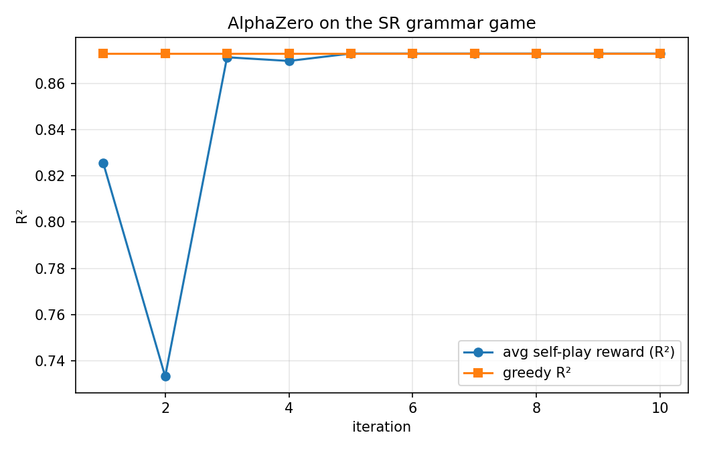

# Symbolic regression as a grammar game

## Table of contents

- [Introduction](#introduction)
- [0. Data & vocabulary](#0-data--vocabulary)
- [1. The derivation game](#1-the-derivation-game)
- [2. The SR grammar](#2-the-sr-grammar)
- [3. Terminal reward: fit the constants, score the structure](#3-terminal-reward-fit-the-constants-score-the-structure)
- [4. A worked episode (Figure 1)](#4-a-worked-episode-figure-1)
- [5. Why the game is nontrivial](#5-why-the-game-is-nontrivial)
- [6. First training run (seed 42, Figure 2)](#6-first-training-run-seed-42-figure-2)
- [Appendix: Source map](#appendix-source-map)
- [Appendix: Reproduce](#appendix-reproduce)

## Introduction

1. This note specifies symbolic regression as a single-player grammar game: what the state, actions, and legality mask are; how the terminal reward scores an emitted expression; one worked episode replayed through the real environment; and the first AlphaZero training run on the game (§6).
2. The game is context-free derivation as an MDP: a 15-slot token buffer holds the current sentential form, and each action rewrites one nonterminal with one production (§1).
3. The grammar offers four primitives — a constant, a linear term, a quadratic term, and a sinusoid — combined by $\{+,*,/\}$; the agent chooses only the *structure*, the constants $C_k$ remain symbols (§2).
4. At termination the constants are fitted by least squares against the target data; the reward is the $R^2$ of the fit, clipped to $[-1,1]$ (§3).
5. The hidden target is $4\sin(4x) + C_0^* + C_1^* x + C_2^* x^2$, sampled at 41 points on $[1,3]$; the constants $C^* \sim U[1,4]^3$ are drawn **once** from the problem seed and fixed across episodes (per-episode resampling is opt-in). This note — figure, measured scores, and training run — uses problem seed 42 throughout (§0).
6. The generating form needs 18 prefix tokens but the mask caps sentences at 14, so a perfect fit is unreachable; the best expressible surrogate is the 14-token sin-plus-constant-plus-quadratic form, which scores $R^2 = 0.9873$ (§5).
7. Figure 1 shows a scripted 5-action episode that derives exactly that frontier expression and is scored through the full fit pipeline (§4).
8. Section 6 documents one AlphaZero run at default hyperparameters (10 iterations × 20 self-play games × 25 simulations): it converges in the first iteration to the single-production expression $C_1 x$ ($R^2 = 0.8729$) and never escapes — a baseline, not a success.

## 0. Data & vocabulary

> **Goal.** Name the objects every later section manipulates: the target sample and the token alphabet.

One *episode* derives one prefix-notation expression and receives one terminal reward. The reward is computed against the *target sample*: noiseless evaluations $y_n = y(x_n)$ of

$$y(x) = 4\sin(4x) + C_0^* + C_1^* x + C_2^* x^2, \qquad C^* \sim U[1,4]^3,$$

at 41 equispaced points $x_n \in [1,3]$.

The $C^*$ are drawn once at construction from the problem seed and then **fixed**: the same expression scores identically across episodes. Per-episode resampling — fresh $C^*$ every reset, the original stochastic behavior — is opt-in.

This note's instance is problem seed 42, whose constants are $C_0^* = 3.322$, $C_1^* = 2.317$, $C_2^* = 3.576$. The training driver reuses its run seed as the problem seed, so the seed-42 run in §6 plays this same instance.

| Symbol | Plain-English meaning | Formula / value | Why it matters |
|---|---|---|---|
| $V$ | token alphabet | $\{0{:}S,\,1{:}{+},\,2{:}C_0,\,3{:}{*},\,4{:}C_1,\,5{:}x,\,6{:}C_2,\,7{:}/,\,8{:}C_3,\,9{:}\sin,\,10{:}C_4\}$, pad $=11$ | ids assigned in order of first appearance in the production list |
| $s$ | state buffer | $s \in (V \cup \{\text{pad}\})^{15}$, left-justified | fixed-length observation the network sees |
| $\ell(s)$ | un-padded length | index of first pad | drives the mask's overflow bound |
| $a=(i,j)$ | action | flat index $7i+j$, 105 actions | rewrite slot $i$ with production $p_j$ |
| $\pi$ | emitted sentence | prefix expression at termination | the object the reward scores |
| $\rho(\pi)$ | terminal reward | clipped $R^2$, boxed in §3 | the game's only nonzero reward |
| $y(x)$, $C^*$ | target and its constants | displayed above | fixed per problem instance; resampled per episode only in the opt-in stochastic variant |

## 1. The derivation game

> **Goal.** Define the MDP: state, action, legality, transition, termination.

- **State.** A buffer $s \in (V \cup \{\text{pad}\})^{15}$ holding the current sentential form left-justified, pad-filled; initial state $s_0 = [S, \text{pad}, \dots, \text{pad}]$.
- **Action.** A pair $a = (i, j)$: rewrite the symbol at buffer position $i$ using global production $p_j$. Networks see the flattened index $7i + j$.
- **Transition.** Splice-replace: the tail shifts right and $\mathrm{rhs}(p_j)$ overwrites position $i$.
- **Termination.** When no nonterminal remains, the episode is done and the buffer decodes to the emitted sentence $\pi$. Invalid or overflowing actions **fail closed**: the episode terminates immediately with reward $-1$ — unreachable under masked play, but a deliberate guard.

The legality mask is the load-bearing definition:

$$\boxed{\,m(s)_{ij} = 1 \iff s_i \text{ is a nonterminal} \;\wedge\; \mathrm{lhs}(p_j) = s_i \;\wedge\; \ell(s) + \lvert\mathrm{rhs}(p_j)\rvert - 1 \le 14\,}$$

> **How to read it.** An action is legal iff it rewrites an actual nonterminal with one of that nonterminal's own productions, and the spliced result still fits the buffer. The bound is strict — the new length may reach 14, not 15 — so finished sentences carry at most 14 tokens, one fewer than the buffer holds.

## 2. The SR grammar

> **Goal.** List the seven productions the agent composes.

| $j$ | production $p_j$ | $\lvert\mathrm{rhs}\rvert$ |
|---|---|---|
| 0 | `S -> '+' S S` | 3 |
| 1 | `S -> 'C0'` | 1 |
| 2 | `S -> '*' 'C1' 'x'` | 3 |
| 3 | `S -> '*' 'C2' '*' 'x' 'x'` | 5 |
| 4 | `S -> '*' S S` | 3 |
| 5 | `S -> '/' S S` | 3 |
| 6 | `S -> '*' 'C3' 'sin' '*' 'C4' 'x'` | 6 |

Sentences are prefix (Polish) notation expressions: $\{+,*,/\}$-combinations of the four primitives $C_0$, $C_1 x$, $C_2 x^2$, $C_3\sin(C_4 x)$. Every RHS symbol with no productions of its own — the $C_k$, $x$, the operators, $\sin$ — is a terminal; $S$ is the only nonterminal.

The key framing: **the game chooses only the structure — the $C_k$ are symbols, not numbers.** Continuous constants never appear in the action space; they are optimized inside the reward evaluation (§3).

## 3. Terminal reward: fit the constants, score the structure

> **Goal.** Define the pipeline that turns an emitted sentence into a scalar reward.

At termination the emitted prefix sentence $\pi$ is scored in four steps:

1. **Prefix → infix.** A stack pass converts, e.g., `+ * C3 sin * C4 x + C0 * C2 * x x` to `((C3*sin((C4*x)))+(C0+(C2*(x*x))))`.
2. **Parse and compile.** The infix string is parsed symbolically and compiled to a callable $f_\pi(x;\, C)$ over the constants $C$ appearing in $\pi$.
3. **Fit.** Least squares over the constants (lmfit), every coordinate initialized to $2.5$:

$$\hat C = \mathrm{argmin}_{C} \sum_{n=1}^{41} \big(y_n - f_\pi(x_n;\, C)\big)^2.$$

4. **Reward.** With $\mathrm{SS}_{\mathrm{res}} = \sum_n (y_n - f_\pi(x_n; \hat C))^2$ and $\mathrm{SS}_{\mathrm{tot}} = \sum_n (y_n - \bar y)^2$:

$$\boxed{\,\rho(\pi) = \mathrm{clip}\!\big(R^2,\, -1,\, 1\big), \qquad R^2 = 1 - \frac{\mathrm{SS}_{\mathrm{res}}}{\mathrm{SS}_{\mathrm{tot}}}\,}$$

> **How to read it.** The reward is the fraction of target variance the *fitted* structure explains, floored at $-1$ so pathological division expressions cannot poison the value target. Structure quality is measured through an optimization oracle: a good structure whose fit stalls in a local minimum scores below its potential.

Two implementation facts. The pipeline **fails soft**: an unparseable sentence, a failed lmfit solve, or a non-finite $R^2$ yields $-1$ rather than raising (e.g. the lone sinusoid `* C3 sin * C4 x` fails to fit at this instance and scores $-1$). And fits are **cached per sentence** — sound because the constants are fixed; the cache is cleared whenever the constants are resampled.

| Regime | Meaning |
|---|---|
| $\rho = 1$ | fitted structure reproduces the target exactly (unreachable here, §5) |
| $\rho \approx 1$ | residual variance near zero after fitting — trend and sinusoid both matched |
| $\rho = 0$ | no better than predicting the mean $\bar y$ (e.g. a lone constant) |
| $\rho = -1$ | clip floor: degenerate division structures, parse failures, failed fits |

## 4. A worked episode (Figure 1)

> **Goal.** Trace one mask-legal episode end-to-end: derivation, termination, fit, reward.

A scripted, mask-legal 5-action episode on the seed-42 instance, replayed through the real environment:

| $t$ | action $(i, j)$ | flat $7i{+}j$ | production applied | state after |
|---|---|---|---|---|
| 0 | — | — | — | `S` |
| 1 | (0, 0) | 0 | `S -> '+' S S` | `+ S S` |
| 2 | (1, 6) | 13 | `S -> '*' 'C3' 'sin' '*' 'C4' 'x'` | `+ * C3 sin * C4 x S` |
| 3 | (7, 0) | 49 | `S -> '+' S S` | `+ * C3 sin * C4 x + S S` |
| 4 | (8, 1) | 57 | `S -> 'C0'` | `+ * C3 sin * C4 x + C0 S` |
| 5 | (9, 3) | 66 | `S -> '*' 'C2' '*' 'x' 'x'` | `+ * C3 sin * C4 x + C0 * C2 * x x` — done, 14 tokens |

> **What this figure shows:** the 15-slot buffer being rewritten production-by-production until no nonterminal remains — ending exactly at the 14-token cap — then the terminal constant-fit that scores the emitted structure against the 41 target points.


**Figure 1: Symbolic regression as a grammar game — one scripted episode.** *Read.* Panel A: the derivation grows left to right, one action per row, and terminates once the fifth action removes the last nonterminal, filling 14 of the 15 slots. Panel B: the target points rise steeply and near-linearly while the fitted curve tracks the trend but smooths out the sinusoidal wiggle, since the sine frequency is mis-fitted.

| Reading | Statement |
|---|---|
| Literal | Panel A: six rows of the 15-slot buffer ($s_0,\dots,s_5$); colors per the legend. Panel B: 41 black target points, the blue least-squares fit of the emitted structure, and an annotation box with the fitted constants. |
| Math/Comp | Actions $(0,0),(1,6),(7,0),(8,1),(9,3)$ emit the 14-token sentence `+ * C3 sin * C4 x + C0 * C2 * x x`, i.e. $C_3\sin(C_4x) + C_0 + C_2x^2$; the fit reaches $R^2 = 0.9873$, so $\rho = 0.9873$, with $\hat C_0 = 1.46$, $\hat C_2 = 4.67$, $\hat C_3 = -5.09$, $\hat C_4 = 2.54$. |
| Interp | This is the best-reachable structure (exactly at the 14-token cap), yet its score is set by an imperfect oracle: the nonconvex sine-frequency fit stalls at $\hat C_4 = 2.54$ near its init $2.5$ (true frequency $4$), $\hat C_3$ goes negative to repurpose the mis-fitted sine as a slow correction, and the omitted linear term is absorbed by the constant, quadratic, and sine. The action sequence is scripted for exposition, not produced by a learned policy or search. |

## 5. Why the game is nontrivial

> **Goal.** State the four properties that make this a hard RL problem rather than an enumeration exercise.

- **The generating form is inexpressible.** The mask (§1) caps sentences at 14 tokens; the generating form $C_3\sin(C_4x) + C_0 + C_1x + C_2x^2$ needs 18 prefix tokens, so $R^2 = 1$ is unreachable and the agent must find the best expressible surrogate. The frontier is tight: Figure 1's episode — `+ * C3 sin * C4 x + C0 * C2 * x x` ($\sin$ + constant + quadratic) — is exactly 14 tokens, legal, and scores $0.9873$.
- **Sparse reward.** $\rho(\pi)$ arrives only at termination; all intermediate steps score 0.
- **Deterministic-by-default reward.** By default each structure has one fixed score, so this is a deterministic sparse-reward search problem with noise-free value targets — and a sound fit cache. The stochastic variant, where the value of a structure is an expectation over resampled $C^*$, is recoverable via the opt-in per-episode resampling.
- **Nonconvex inner fit.** Fitting the sine frequency from init $2.5$ toward the true $4$ is nonconvex; Figure 1's episode stalls at $\hat C_4 = 2.54$, and even the true 18-token form only fits to $R^2 = 0.9996$. Structure quality is thus measured through an imperfect oracle.

The measured score ladder on the seed-42 instance (each value measured through the reward pipeline of §3, deterministic):

| structure | prefix tokens | $\rho$ |
|---|---|---|
| $C_0$ | 1 | $0.0000$ |
| $C_3\sin(C_4x)$ | 6 | $-1.0000$ (fit fails) |
| $C_2x^2$ | 5 | $0.8409$ |
| $C_1x$ | 3 | $0.8729$ |
| $C_1x + C_2x^2$ | 7 | $0.9316$ |
| $C_0 + C_1x + C_2x^2$ | 9 | $0.9731$ |
| $C_3\sin(C_4x) + C_0 + C_2x^2$ (frontier, Fig. 1) | 14 | $0.9873$ |
| generating form (needs a buffer of $\ge 19$ slots) | 18 | $0.9996$ — unreachable |

## 6. First training run (seed 42, Figure 2)

> **Goal.** Document one AlphaZero run at default hyperparameters — the baseline every later experiment compares against.

One run of the training driver at all-default hyperparameters, seed 42 — the same problem instance as the rest of this note (command in the Reproduce appendix). Total wall clock ≈ 3 s: episodes are 1–13 actions and lmfit calls are cheap and cached.

- **Search:** 10 iterations × 20 self-play games × 25 MCTS simulations, sequential.
- **Network:** MLP 2×128 on the one-hot $15 \times 12$ observation.
- **Optimization:** Adam, lr $10^{-3}$, 10 epochs, batch 32.
- **Exploration:** temperature 1.0, $c_{\mathrm{explore}}$ 1.0, Dirichlet noise $(0.3, 0.25)$.
- **Eval:** 1 greedy episode per iteration.

| iteration | greedy $R^2$ | avg self-play $R^2$ | train loss | wall clock (s) |
|---|---|---|---|---|
| 1 | $0.8729$ | $0.8255$ | $5.250$ | $1.21$ |
| 2 | $0.8729$ | $0.7333$ | $4.019$ | $0.73$ |
| 5 | $0.8729$ | $0.8729$ | $1.379$ | $0.12$ |
| 10 | $0.8729$ | $0.8729$ | $0.645$ | $0.14$ |

Best expression found: `* C1 x`, i.e. $C_1 x$, at $\rho = 0.8729$ — found at iteration 1 and never improved. The known ceiling is the 14-token frontier at $0.9873$ (§5).

> **What this figure shows:** the greedy-policy reward and the average self-play reward per iteration over the full 10-iteration run.



**Figure 2: AlphaZero on the SR grammar game — first run, seed 42.** *Read.* The greedy-policy line is flat from the first iteration; the average self-play reward dips while noise still explores, then converges onto the greedy line and stays there.

| Reading | Statement |
|---|---|
| Literal | Two series over 10 iterations: the greedy-policy $R^2$, constant throughout, and the average self-play $R^2$, which dips early and then joins the greedy line. |
| Math/Comp | Greedy $R^2 = 0.8729$ at every iteration; avg self-play $R^2$ falls from $0.83$ to $0.73$ at iteration 2, then sits at $0.8729$ from iteration 5. From iteration 3 on, nearly every self-play game is the 1-action episode `* C1 x`; training loss falls $5.25 \to 0.65$ as the network memorizes that single trajectory. |
| Interp | Premature convergence to a one-action local optimum: $C_1 x$ is the best *single-production* sentence (§5's ladder), and once the policy concentrates there, 25 simulations of temperature-1 self-play never composes the multi-production structures ($0.9316$ upward) that require passing through lower-immediate-value nonterminal states. The baseline motivates stronger exploration — more simulations, higher temperature, or explicit novelty pressure — in the next note. |

## Appendix: Source map

All game code lives in `src/sraz/`; Figures 1–2 are produced by the scripts below, never hand-drawn.

| Topic | Source |
|---|---|
| SR grammar (7 productions) | [game.py:60-70](../../src/sraz/instances/symreg/game.py#L60-L70) |
| Token/production compilation | [game.py:86-111](../../src/sraz/instances/symreg/game.py#L86-L111) |
| Prefix → infix conversion | [game.py:37-50](../../src/sraz/instances/symreg/game.py#L37-L50) |
| Target, constants, data grid | [game.py:118-128](../../src/sraz/instances/symreg/game.py#L118-L128), [game.py:201-204](../../src/sraz/instances/symreg/game.py#L201-L204) |
| Constant fit and clipped reward | [game.py:131-163](../../src/sraz/instances/symreg/game.py#L131-L163) |
| Buffer reset and initial state | [game.py:206-216](../../src/sraz/instances/symreg/game.py#L206-L216) |
| Legality mask | [game.py:218-228](../../src/sraz/instances/symreg/game.py#L218-L228) |
| Splice transition, termination, fail-closed guard | [game.py:230-252](../../src/sraz/instances/symreg/game.py#L230-L252) |
| Fit cache | [game.py:262-265](../../src/sraz/instances/symreg/game.py#L262-L265) |
| MCTS stash/unstash | [game.py:272-293](../../src/sraz/instances/symreg/game.py#L272-L293) |
| Engine Game ABC (`reset_wrapper`/`step_wrapper`/`clone`) | [core/game.py:67-108](../../src/sraz/core/game.py#L67-L108) |
| SR hyperparameter defaults | [config.py](../../src/sraz/instances/symreg/config.py) |
| Contract test replaying the worked episode | [test_grammar_env.py:58-72](../../tests/test_grammar_env.py#L58-L72) |
| Training driver (§6) | [run_symreg.py](../../scripts/run/run_symreg.py) |
| Figure 1 driver | [plot_sr_game.py](../../scripts/plotting/plot_sr_game.py) |

## Appendix: Reproduce

```bash
# from repo root; writes docs/notes/figures/sr_game_progression.png (Figure 1)
python scripts/plotting/plot_sr_game.py

# the documented training run (§6); writes experiments/symreg/<timestamp>_seed42_mcts25_iter10/
python scripts/run/run_symreg.py --seed 42
# Figure 2 is reward_curve.png copied from that experiment dir:
#   cp experiments/symreg/<run>/reward_curve.png docs/notes/figures/symreg_reward_curve_seed42.png
```
