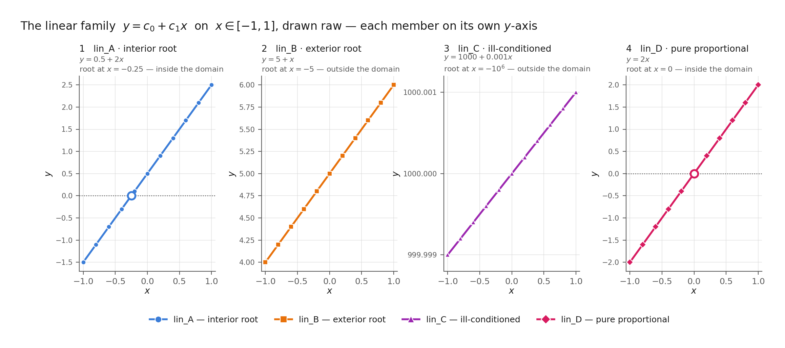
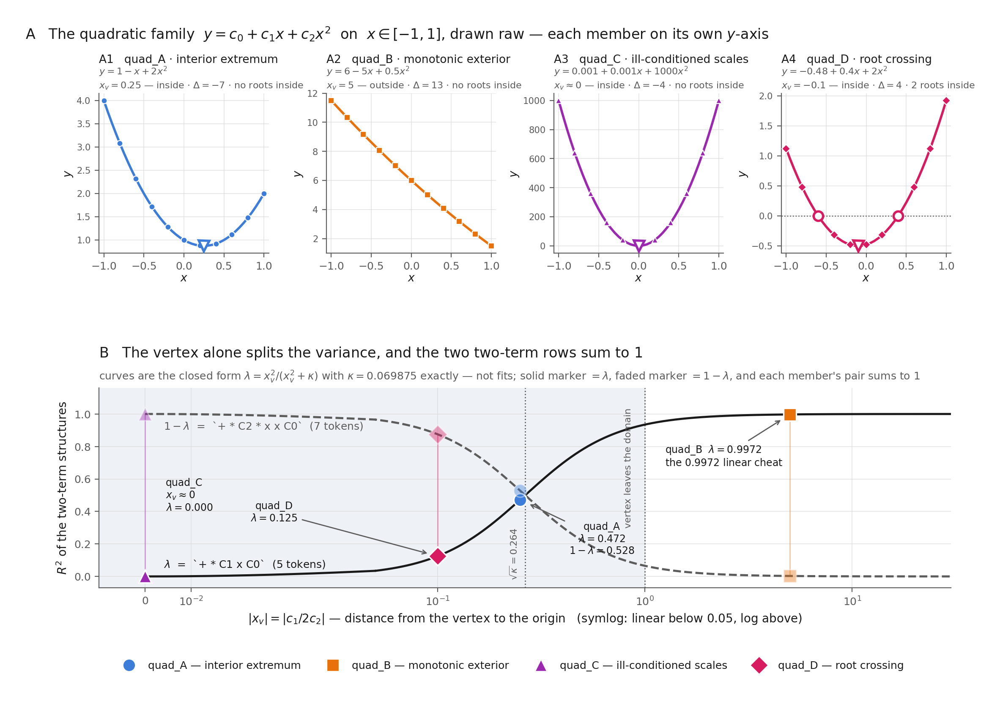
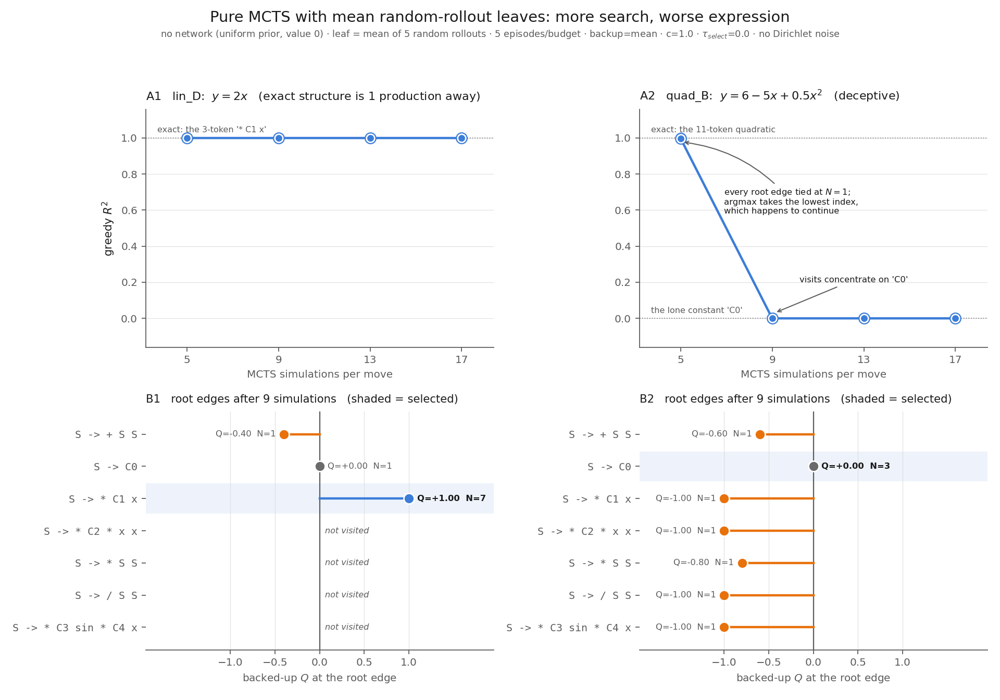

# Target families for the grammar game

## Table of contents

- [1. Target families](#1-target-families)
  - [1.1 The linear family](#11-the-linear-family)
  - [1.2 The quadratic family](#12-the-quadratic-family)
  - [1.3 The reachable-score ladder](#13-the-reachable-score-ladder)
- [2. Pure MCTS against the simulation budget](#2-pure-mcts-against-the-simulation-budget)
  - [2.1 What is switched off](#21-what-is-switched-off)
  - [2.2 The measurement](#22-the-measurement)
  - [2.3 Why the constant wins](#23-why-the-constant-wins)
- [Appendix: Source map](#appendix-source-map)
- [Appendix: Reproduce](#appendix-reproduce)

## 1. Target families

> **Goal.** Define eight hidden functions whose shapes are known rather than sampled.

Sampling $c_i \sim \mathcal N(0,1)$ tests the search against whatever shape the draw happens to produce. Fixing the coefficients instead partitions the function space by geometric invariants taken *relative to the data domain*, so each family member is a topologically distinct shape and a failure can be attributed to a property rather than to luck.

Both families are scored by the same seven-production grammar, sinusoid included. The sinusoid is a **distractor** here: no member needs it, and it scores $-1$ against every one of the eight (its fit fails outright), so a search that reaches for it is buying nothing.

### 1.1 The linear family

$$y = c_0 + c_1 x, \qquad x \in [-1,1].$$

A line has no vertex and no discriminant. The only invariants available are where its root sits relative to the domain, and how its two coefficients are scaled against one another.

| Target | Name | $(c_0, c_1)$ | root | Design intent |
|---|---|---|---|---|
| `lin_A` | interior root | $(0.5,\ 2.0)$ | $-0.25$, interior | the balanced case; both coefficients $O(1)$ |
| `lin_B` | exterior root | $(5.0,\ 1.0)$ | $-5$, exterior | offset dominates; the curve never approaches $0$ on the domain |
| `lin_C` | ill-conditioned | $(1000,\ 0.001)$ | exterior | ill-conditioned: $c_0/c_1 = 10^6$ |
| `lin_D` | pure proportional | $(0.0,\ 2.0)$ | $0$ | exactly the 3-token `* C1 x` |

> **What this figure shows** The four members drawn raw, and the one score that varies across them as a closed form in the root.



**Figure 1: The linear family and the invariant that scores it.** *Read.* Row A draws each member on its own $y$-axis; row B is exact arithmetic, not a measurement. Both are deterministic — no seed, no search.

| Reading | Statement |
|---|---|
| Literal | Row A: four raw lines over $x\in[-1,1]$, roots inside the domain ringed. Row B: $R^2$ of the 3-token `* C1 x` against $\rho = \lvert c_0/c_1\rvert$ (symlog $x$), with the four members marked. |
| Math/Comp | Fitting `* C1 x` to $c_0 + c_1x$ leaves residual $c_0$ and gives $R^2 = \mathrm{clip}(1 - \rho^2/\langle x^2\rangle)$ with $\langle x^2\rangle = 0.35$ exactly. It crosses $0$ at $\rho = 0.592$ and floors at $\rho = 0.837$ — both *inside* the domain. |
| Interp | The family has one degree of freedom that the reward can see. The other four ladder rows are constant down the whole column (§1.3), so this single curve is the linear family's entire content. |

Per-member axes are not a presentational retreat. The reward is exactly invariant to $y \mapsto ay$ but not to $y \mapsto y + b$, and the $10^6$ spread these members are built around lives in the **offset** — so the one normalization that would put them on a shared axis is the one that destroys them. Z-scoring makes the point sharply: every non-degenerate line is the *same* line once shifted and scaled, so a z-scored panel draws `lin_A`–`lin_D` as a single curve and claims to have shown four. Both facts are asserted by test, not asserted here.

Two of the design intents read differently once drawn. The ill-conditioned member is not merely awkward to fit — on this domain it *is* a constant, varying by $2\times10^{-6}$ about $1000$, which is why panel A3 needs six decimals to show a slope at all. And the exterior-root and ill-conditioned members sit $10^5$ apart in $\rho$ yet score identically, because the clip floor has already erased the difference: §1.3's "clipping hides ordering" is visible here as two members landing on one value.

### 1.2 The quadratic family

$$y = c_0 + c_1 x + c_2 x^2, \qquad x \in [-1,1],$$

partitioned by the vertex $x_v = -c_1/2c_2$ and the discriminant $\Delta = c_1^2 - 4c_0c_2$.

| Target | Name | $(c_0, c_1, c_2)$ | $x_v$ | $\Delta$ | Roots in domain | Design intent |
|---|---|---|---|---|---|---|
| `quad_A` | interior extremum | $(1,\ -1,\ 2)$ | $0.25$, interior | $-7$ | none | a genuine turnaround forbids a linear cheat |
| `quad_B` | monotonic exterior | $(6,\ -5,\ 0.5)$ | $5$, exterior | $13$ | none | monotonic and sign-stable: looks like a line |
| `quad_C` | ill-conditioned scales | $(0.001,\ 0.001,\ 1000)$ | $\approx 0$, interior | $-4$ | none | ill-conditioned: $c_2/c_1 = 10^6$ |
| `quad_D` | root crossing | $(-0.48,\ 0.4,\ 2)$ | $-0.1$, interior | $4$ | $-0.6,\ 0.4$ | the curve passes through $y = 0$ |

No two of these share a $(\text{vertex inside},\ \text{roots inside},\ \text{monotonic})$ signature except the interior-extremum and ill-conditioned members, which the $10^6$ scale ratio separates instead. This is asserted by test, because a family that fails to partition is four arbitrary parabolas.

Two coefficients are load-bearing against the partition rather than free. The monotonic-exterior target needs $c_0 = 6$ to keep both roots outside the domain — the natural $(1,-5,0.5)$ leaves one at $x = 0.204$, which would make it a sign-changing curve and collide with the root-crossing member. The root-crossing target needs *asymmetric* roots at $-0.6$ and $0.4$: symmetric roots force $c_1 = 0$, and a target with no linear term is fitted exactly by the 7-token `+ * C2 * x x C0`, which would make it strictly easier than the interior-extremum member while purporting to be harder.

> **What this figure shows** The four members drawn raw, and both two-term scores as closed forms in the vertex.



**Figure 2: The quadratic family and the invariant that scores it.** *Read.* Row A draws each member on its own $y$-axis, ringing roots and marking the vertex where each lies inside the domain; row B is exact arithmetic, not a measurement.

| Reading | Statement |
|---|---|
| Literal | Row A: four raw parabolas over $x\in[-1,1]$. Row B: $R^2$ of the 5-token `+ * C1 x C0` (solid) and the 7-token `+ * C2 * x x C0` (dashed) against $\lvert x_v\rvert$ (symlog $x$); each member contributes one marker to each curve. |
| Math/Comp | On a domain symmetric about the origin, $x$ and $x^2 - \langle x^2\rangle$ are orthogonal, so the variance splits into a linear share $\lambda = x_v^2/(x_v^2 + \kappa)$ and a curvature share $1 - \lambda$, with $\kappa = 0.069875$ exactly. The two rows sum to $1$ on every member. |
| Interp | Each target's pair of two-term scores is **one number**, set by the vertex alone — the invariant §1.2 partitions by. The vertex does not merely label the shape; it computes the score. |

The split makes the ladder's middle rows predictions rather than observations: $\lambda$ at $x_v = 0.25,\ 5,\ \approx 0,\ -0.1$ is $0.472,\ 0.997,\ 0.000,\ 0.125$, which is §1.3's `C1x + C0` row exactly. The interior-extremum member sits near the crossing at $\lvert x_v\rvert = \sqrt{\kappa} = 0.264$, which is why its variance divides almost evenly and why neither two-term structure can take it.

**The trap depth is a design parameter, not a discovery.** The monotonic-exterior member's $0.9972$ linear cheat is $\lambda(x_v = 5)$ — forced the moment its vertex was placed at $5$. Pushing the vertex further out drives $\lambda \to 1$ and deepens the trap; pulling it toward $\sqrt{\kappa}$ removes it. The deception is set here, in §1.2, by one coefficient ratio.

### 1.3 The reachable-score ladder

Every value measured through the reward pipeline under a 50-evaluation cap, deterministic:

| structure | tokens | `lin_A` | `lin_B` | `lin_C` | `lin_D` | `quad_A` | `quad_B` | `quad_C` | `quad_D` |
|---|---|---|---|---|---|---|---|---|---|
| $C_0$ | 1 | $0.000$ | $0.000$ | $0.000$ | $0.000$ | $0.000$ | $0.000$ | $0.000$ | $0.000$ |
| $C_1x$ | 3 | $0.821$ | $-1.000$ | $-1.000$ | $\mathbf{1.000}$ | $-1.000$ | $-1.000$ | $-1.000$ | $0.017$ |
| $C_2x^2$ | 5 | $-0.079$ | $-1.000$ | $-1.000$ | $-0.000$ | $-0.071$ | $-1.000$ | $\mathbf{1.000}$ | $0.646$ |
| $C_1x + C_0$ | 5 | $\mathbf{1.000}$ | $\mathbf{1.000}$ | $\mathbf{1.000}$ | $\mathbf{1.000}$ | $0.472$ | $0.997$ | $0.000$ | $0.125$ |
| $C_2x^2 + C_0$ | 7 | $-0.000$ | $0.000$ | $-0.000$ | $0.000$ | $0.528$ | $0.003$ | $\mathbf{1.000}$ | $0.875$ |
| $C_0 + C_1x + C_2x^2$ | 11 | $\mathbf{1.000}$ | $\mathbf{1.000}$ | $\mathbf{1.000}$ | $\mathbf{1.000}$ | $\mathbf{1.000}$ | $\mathbf{1.000}$ | $\mathbf{1.000}$ | $\mathbf{1.000}$ |
| $C_3\sin(C_4x)$ | 6 | $-1.000$ | $-1.000$ | $-1.000$ | $-1.000$ | $-1.000$ | $-1.000$ | $-1.000$ | $-1.000$ |

**The 11-token three-term quadratic scores $1$ on all eight.** It is the universal exact structure, and it fits comfortably under the 14-token cap. Unlike the first note's instance — where the generating form needed 18 tokens and a perfect fit was *unreachable* — every target here is exactly expressible, so $R^2 = 1$ is a real ceiling rather than an aspiration.

**The monotonic-exterior target sets its trap as designed.** A purely linear derivation explains $99.7\%$ of it. The remaining $0.3\%$ is the entire signal distinguishing a 5-token local optimum from an 11-token global one, and whether a search notices is exactly the sensitivity question that member was built to ask.

**Clipping hides ordering.** Many entries sit at exactly $-1.000$, the clip floor, where structures of very different badness become indistinguishable. A search cannot gradient its way out of a plateau it cannot see across.

## 2. Pure MCTS against the simulation budget

> **Goal.** Spend the ladder of §1.3 on the simplest search that can play the game, and read what the budget buys.

### 2.1 What is switched off

The experiment is defined by its subtractions. Everything that could learn, remember, or explore off-policy is disabled, leaving three moving parts: a uniform prior over the legal productions, a leaf value that is the mean of five random completions, and a visit-count argmax at each move. An emitted expression is then a function of the simulation budget and the rollout draws alone.

| Knob | Value | Why this value makes the experiment simple |
|---|---|---|
| network | uniform prior, value $0$ | nothing is learned, so no training curve can confound the budget |
| $N_{\text{sim}}$ | $5, 9, 13, 17$ | the swept axis: $5$–$20$ in steps of $4$ ($21$ would leave the range) |
| targets | `lin_D`, `quad_B` | one panel each: the exactly-reachable case and the deceptive one (§1.1–1.2) |
| leaf value | mean of $5$ random rollouts | the only estimator; `rollout_blend` $=0$ so the net's $0$ never mixes in |
| episodes | $5$ per cell | rollouts are the *only* RNG, so repeats measure exactly that noise |
| backup rule | `mean` | one rule; the mean-vs-max comparison is a separate question |
| $c_{\text{exploration}}$ | $1.0$ | the UCB constant, held fixed |
| $\tau$ | $1.0$ in search, $0$ at selection | argmax over visit counts: no sampling noise on top of the rollouts |
| Dirichlet noise | off | no root exploration noise |
| `rollout_budget` | $10^6$ | set so it never binds; at $500$ it silently starves leaves past the seventh |
| `lmfit_max_nfev` | $50$ | the §1.3 ladder's cap, so the reachable scores are the ones tabulated there |
| trainer | none | with the network disabled an iteration would batch episodes and propagate nothing |

Two of these are load-bearing rather than cosmetic. **The rollout budget must not bind**: at the default $500$ steps, five rollouts per leaf exhaust it after roughly seven leaf expansions, and further leaves fall back to the network's $0$ — which is a *different estimator*, silently swapped in mid-search. And **rollouts are the only randomness**: with `rollout_n` $=0$ the search consults no RNG at all and every episode is identical, which is what the five repeats are here to exercise.

### 2.2 The measurement

> **What this figure shows** Greedy $R^2$ against the simulation budget on both targets (row A), and the root-edge $Q$ that decides each curve (row B).



**Figure 3: Pure MCTS with mean random-rollout leaves.** *Read.* Row A: five episodes per budget, drawn individually behind their mean. Row B: the backed-up $Q$ on each root edge after $9$ simulations, in grammar order, shaded where the visit-count argmax lands.

| Reading | Statement |
|---|---|
| Literal | A1: `lin_D` sits at $R^2 = 1.0000$ at every budget, spread zero. A2: `quad_B` reads $+0.9978$ at $5$ simulations and exactly $0.0000$ at $9$, $13$, $17$. B1: `lin_D`'s `* C1 x` edge holds $Q = +1.00$ with $N = 7$; three edges are never visited. B2: `quad_B`'s `C0` edge holds $Q = +0.00$ with $N = 3$ and is the **largest** $Q$ at the root; every other edge is negative. |
| Math/Comp | On `quad_B` the mean of five random completions is negative on every continuing branch ($-0.60$ to $-1.00$), because the grammar's reachable structures are dominated by the $-1$ clip floor (§1.3). Terminating immediately via `S -> C0` scores exactly $0$. Since $0 > -0.60$, UCT ranks doing nothing above every continuation. |
| Interp | More search makes the emitted expression **worse**, and the search is not malfunctioning — it is correctly optimising a leaf estimator that says every road forward is bad. |

The five episodes contribute almost nothing: the standard deviation is $0.0011$ at `quad_B`'s $5$-simulation cell and exactly $0$ in all seven others. A stochastic leaf evaluator yields a near-deterministic curve, because the argmax that picks the move is insensitive to the rollout noise at these budgets.

### 2.3 Why the constant wins

**`lin_D` is a control, not a measurement.** Its exact structure `* C1 x` is one production from the root and *terminal*, so the first simulation to try it backs up $Q = +1.00$ and no budget can do better. Three of the seven productions are never visited at all. A budget sweep on `lin_D` cannot show anything, which is worth stating rather than presenting a flat line as a result.

**`quad_B`'s pre-collapse point is a tie-break, not a success.** At $5$ simulations every root edge that has been tried carries $N = 1$; the visit counts are tied, and `np.argmax` resolves the tie at the lowest flat index, which is production $0$, `S -> + S S`. That edge continues the derivation, and the episode stumbles into `+ + + + * C1 x + C0 C0 C0 C0 C0` — thirteen tokens that reduce to $C_1x + C_0$, the $0.9972$ linear cheat §1.2 built into the target. Search did not find that structure; the tie-break did. Reporting $0.9978$ as search succeeding at a low budget would be reading a figure exactly backwards.

From $9$ simulations on, there are enough visits for the $Q$ ordering to actually bind, the argmax moves to `C0`, and the episode emits the constant. The collapse is therefore not a plumbing bug but the estimator working as specified: **mean-aggregating rollouts over a grammar whose structures mostly hit the clip floor makes every continuation look worse than quitting.**

This is a property of the aggregation, not of rollouts. The `mean`/`max` split is already visible in this repo's earlier `quad_A` data, where $5$ averaged rollouts decay from $0.546$ to $0.165$ as the budget goes $5 \to 20$ while $5$ best-of rollouts hold near $1.0$. Drawing the averaged arm alone — as §2 does, by construction — reports that rollouts make search worse. That is true, and on its own it is misleading.

## Appendix: Source map

| Topic | Source |
|---|---|
| Target families and their invariants | [targets.py](../../src/sraz/instances/symreg/targets.py) |
| Pure-MCTS sweep driver (§2) | [run_pure_mcts_targets.py](../../scripts/run/run_pure_mcts_targets.py) |
| Figure 3 driver (§2) | [plot_pure_mcts_targets.py](../../scripts/plotting/plot_pure_mcts_targets.py) |
| Rollout leaf evaluation and the shared budget | [mcts.py:297-339](../../src/sraz/core/mcts.py#L297-L339) |
| Rollouts draw from the global numpy RNG | [mcts.py:322](../../src/sraz/core/mcts.py#L322) |
| Greedy (τ=0, noise-free) episode | [evaluate.py](../../src/sraz/instances/symreg/evaluate.py) |
| Fixed-target mode, domain, optimizer cap | [game.py:188-227](../../src/sraz/instances/symreg/game.py#L188-L227) |
| Inner optimizer cap plumbed to lmfit | [game.py:131-172](../../src/sraz/instances/symreg/game.py#L131-L172) |
| Figures 1 and 2 | [plot_target_families.py](../../scripts/plotting/plot_target_families.py) |
| Family geometry and ladder tests | [test_symreg_targets.py](../../tests/test_symreg_targets.py) |

## Appendix: Reproduce

```bash
# from repo root

# Figures 1 and 2: the two families and the closed forms that score them
python scripts/plotting/plot_target_families.py

# every claim above that is pinned by a test
python -m pytest tests/test_symreg_targets.py -q
```
