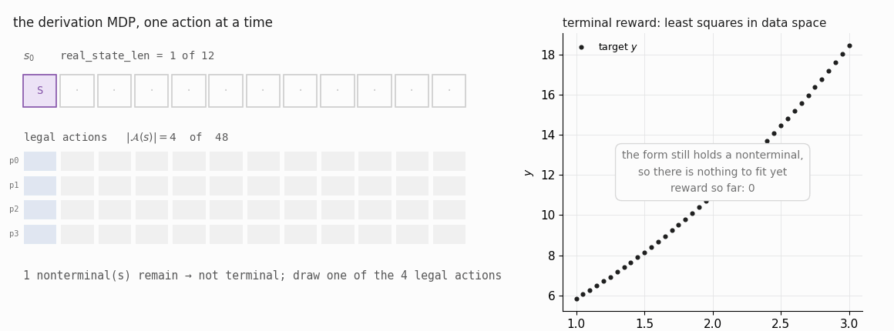
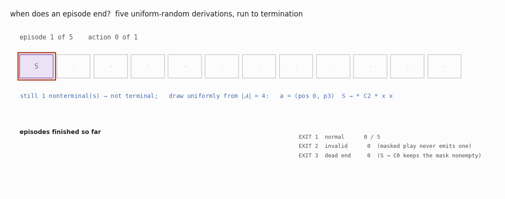

# Elaboration — The derivation MDP as the code implements it, and when it stops

Companion note to §2 of `../writeup.tex` (`sec:derivation-mdp`). The write-up
states the MDP and its termination rule; this note derives both from
`../../src/sraz/instances/symreg/game.py`, proves the two facts the write-up
asserts without proof, and animates them.

Every number below is produced by
`../figures/make_game_figures.py`, `../figures/make_game_gifs.py` and
`../figures/make_family_figures.py`, which import and run `SymRegGame` rather
than restating it.

**Constants.** Instance `additive_quadratic`; buffer length $L=15$ by default,
$L=12$ in every figure here; grammar $G$ with one nonterminal $S$ and $P=4$
productions $w_0,\dots,w_3$.

Two grids appear in this project and must not be conflated. With no named
target the game uses its own defaults, $x_1,\dots,x_{41}\in[1,3]$ and a target
$y(x)=c_0+c_1x+c_2x^2$ whose coefficients are drawn once from `problem_seed`;
that is the configuration animated below. Passing a named `Target` from
`../../src/sraz/instances/symreg/targets.py` — which is what §3 of the
write-up does — overrides both, giving $x_1,\dots,x_{41}\in[-1,1]$ and chosen
coefficients. The MDP is identical either way; only the number each terminal
earns changes.

Throughout, italic $c_0,c_1,c_2$ are the *target's* coefficients while
typewriter `C0`, `C1`, `C2` are the *grammar's* constant tokens, whose values
`lmfit` fits per terminal expression. §1.3 of the write-up
(`subsec:notation`) tabulates the full convention.

---

## 1. The tuple

`SymRegGame` is a deterministic, undiscounted, single-player MDP whose state is
a *sentential form* stored in a fixed-length buffer.

| | as implemented |
|---|---|
| state $s$ | `state`: an array of $L$ tokens, and `real_state_len` $=\lvert s\rvert$, the prefix that is live. Cells beyond it hold the pad token. |
| observation | `MultiDiscrete([nsym+1] * L)` — the pad token is part of the observation alphabet, so the network sees buffer length, not just content. |
| start $s_0$ | `[S]` followed by $L-1$ pads; $\lvert s_0\rvert=1$. |
| action $a$ | `Discrete(L * P)`, decoded as $(\mathrm{pos},\mathrm{prod})=\operatorname{divmod}(a,P)$. |
| legal set $\mathcal A(s)$ | $\mathrm{pos}<\lvert s\rvert$, $\ s[\mathrm{pos}]$ is a nonterminal, $\ \mathrm{prod}\in\mathrm{proddict}[s[\mathrm{pos}]]$, and $\lvert s\rvert+\lvert w_{\mathrm{prod}}\rvert-1<L$. |
| transition $T$ | deterministic: splice $w_{\mathrm{prod}}$ over cell $\mathrm{pos}$, shift the tail right, re-pad. |
| reward $R$ | $0$ at every nonterminal state; at a terminal, $\operatorname{clip}(R^2,-1,1)$ of the lmfit fit of the free constants. |
| discount | $\gamma=1$, and only one reward per episode is nonzero. |

The productions of the additive instance, with the length change each one
causes:

| $\mathrm{prod}$ | production | $\lvert w\rvert$ | $\Delta\lvert s\rvert=\lvert w\rvert-1$ |
|---|---|---|---|
| $w_0$ | $S\to\;$ `+ S S` | 3 | $+2$ |
| $w_1$ | $S\to\;$ `C0` | 1 | $0$ |
| $w_2$ | $S\to\;$ `* C1 x` | 3 | $+2$ |
| $w_3$ | $S\to\;$ `* C2 * x x` | 5 | $+4$ |

Two consequences of the action encoding are worth stating, because they are
easy to get wrong when reasoning about the search.

**The action space is mostly illegal.** The nominal size is $LP=48$; over all
$4{,}651$ nonterminal forms the legal set averages $3.38$ and never exceeds
$16$. The mask, not the action space, is what the search branches on.

**An action names a position, not a symbol.** When a form holds several
nonterminals, the agent chooses *which* one to expand as well as *how*. The
uniform rollout policy is therefore uniform over the flattened
$(\mathrm{pos},\mathrm{prod})$ mask, not uniform over the productions of one
designated slot; the two measures differ as soon as $\lvert s\rvert$ contains
more than one $S$, and $V^q$ inherits whichever one is used.

*The buffer, the mask it induces, the action drawn from that mask, and the
least-squares fit the terminal expression earns. The right panel is empty
until termination because the reward is identically zero before it.*

---

## 2. Termination

`step` has exactly three ways to end an episode. Only one of them can fire.

**EXIT 1 — normal.** `terminated = not self._has_nonterms()`: the live prefix
contains no nonterminal. The finished token string is decoded, converted to
infix, and fitted; the reward is the clipped $R^2$.

**EXIT 2 — invalid action.** A defensive branch returns $R=-1$ and
`terminated = True` when the decoded action is out of range or would overflow
the buffer. Calling `step` off-mask on $s_0$ reproduces it exactly. Under
masked play it is unreachable, and every search path in this repository is
masked.

**EXIT 3 — dead end.** A form still holds a nonterminal but $\mathcal A(s)=\emptyset$.
`step` is never called; `MCTS._rollout_value` hits its `break` and *discards*
the sample rather than scoring it. Proposition 2 shows this cannot happen.

There is no step limit, no truncation, and no stop action: an episode ends when
the form runs out of nonterminals and not before.

### Proposition 1 (length bound) — `prop:length-bound`

**Proposition.** Every reachable form satisfies $\lvert s\rvert\le L-1$. In
particular every terminal expression has at most $L-1$ tokens.

*Proof.* Induction on the number of actions. $\lvert s_0\rvert=1\le L-1$.
If $s'$ is obtained from $s$ by a legal action with production $w$, then the
mask condition $\lvert s\rvert+\lvert w\rvert-1<L$ is exactly
$\lvert s'\rvert<L$, i.e. $\lvert s'\rvert\le L-1$ since lengths are integers. $\square$

The bound is attained: at $L=12$ the longest terminals have $11$ tokens, and
$177$ of the $247$ terminals do. The strict `<` is load-bearing — it is why the
buffer never fills, and why `max_len` must be set one larger than the longest
expression one wants reachable. At $L=11$ the exact expression
`+ C0 + * C1 x * C2 * x x` is excluded and $V^*(s_0)$ becomes
target-dependent: it stays at $1$ for every linear target, which needs only
five tokens, and drops to $0.997213$ on `quad_B` and $0.527856$ on `quad_A`.

### Proposition 2 (no dead ends) — `prop:no-dead-ends`

**Proposition.** Suppose every nonterminal $A$ of $G$ has at least one
production $A\to w$ with $\lvert w\rvert=1$ (an *escape production*). Then
$\mathcal A(s)\neq\emptyset$ for every reachable $s$ containing a nonterminal,
so EXIT 3 never fires.

*Proof.* Let $s$ be reachable with $s[i]=A$ a nonterminal, and let $A\to w$ be
an escape production. The first three mask conditions hold at $(i,\text{that
production})$ by construction. For the fourth,
$\lvert s\rvert+\lvert w\rvert-1=\lvert s\rvert$, and $\lvert s\rvert\le L-1<L$
by Proposition 1. So the action is legal and the mask is nonempty. $\square$

Both shipped grammars satisfy the hypothesis through $S\to$ `C0`, which is why
`SR_GRAMMAR` and `ADDITIVE_GRAMMAR` never stall. An exhaustive census confirms
it: $0$ dead ends among the $4{,}898$ reachable forms.

The hypothesis is a real constraint, not a formality. Deleting `C0` from the
grammar, or capping `max_len` below the shortest completion of some reachable
form, reintroduces dead ends — and because the rollout discards them rather
than scoring them, they would bias $V^q$ silently instead of failing loudly.

### Remark (parity of terminal lengths)

Each action changes the length by $\lvert w\rvert-1\in\{0,2,4\}$, all even, and
$\lvert s_0\rvert=1$. So every reachable form has odd length, and terminals can
only have $1,3,5,7,9,11$ tokens. The census agrees exactly:
$1,2,5,14,48,177$ terminals at those six lengths.

*Five uniform-random derivations. They terminate after $1$ to $5$ actions with
$1$ to $11$ tokens and rewards from $-0.000000$ to $1.000000$; EXIT 1 fires
five times out of five.*

Under the uniform mask policy, episodes are short — mean length $1.84$, mean
reward $0.6273$ — and $P(R=1)=0.0300$. Termination is cheap; the optimum is
not.

---

## 3. The decoy structure is already here

§3 of the write-up varies the *target*, never the MDP. That works because the
root of this MDP already has the shape a controlled decoy experiment needs, and
it needs no second environment to obtain it.

Exactly four actions are legal at $s_0$, one per production, with four distinct
successors. Following eq. `eq:root-decoys` of the write-up we name those four
successor **states** after the production that creates them — they are states,
not actions, which is what lets $V^*$, $V^q$ and $\rho$ be written against
them. Since the four root actions are in bijection with the four children, the
same names index the root edges, as in the visit count $N(s_0,C)$.

| child of $s_0$ | production | outcome |
|---|---|---|
| $C$ | $w_0=$ `+ S S` | continues; the only subtree containing an exact expression, $V^*(C)=1$ |
| $D_1$ | $w_1=$ `C0` | terminal at once, $V^*(D_1)=V^q(D_1)=R(D_1)$ |
| $D_2$ | $w_2=$ `* C1 x` | terminal at once |
| $D_3$ | $w_3=$ `* C2 * x x` | terminal at once |

Three of the four productions carry no nonterminal on the right, so $D_1$,
$D_2$ and $D_3$ are already terminal and the episode ends after one step.
Root value-semantic failure is therefore the single inequality
$\max_i R(D_i)>V^q(C)$ *together with* $\max_i R(D_i)<1$; the second half is
what distinguishes a trap from a target that a one-action expression simply
solves. Across the eight named targets of
`src/sraz/instances/symreg/targets.py` the first holds four times and both hold
twice (`lin_A`, `quad_D`).

`../figures/make_family_figures.py` computes all of it by the same exhaustive
census — $V^*$, $V^q$ and $\rho$ by one backward induction over the DAG, the
fitter called once per terminal and cached, so a target costs $247$ fits rather
than $4{,}898$.
