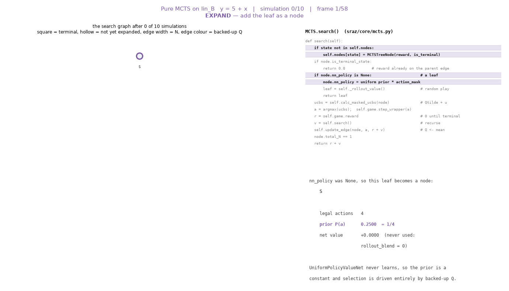

# The pure-MCTS searcher, as implemented

What `sraz`'s search actually does, read off the code rather than off the
algorithm's name. Every claim here is either a line reference or something
measured by running the shipped searcher; where the implementation departs from
the write-up's eq. `eq:mean-uct`, that is called out rather than smoothed
over, because several of the departures change what a result means.

The searcher lives in `src/sraz/core/mcts.py` (560 lines, two classes:
`MCTSTreeNode` and `MCTS`). The
animation `gifs/pure-mcts.gif` steps through one search phase per frame and is
generated by `../figures/make_mcts_algorithm_gif.py`, which instruments the real
`MCTS` object rather than reimplementing it.

---

## 1. What "pure" means: two substitutions, not a different algorithm

The repo ships **one** search class. "Pure MCTS" is that same class with the
learned network swapped out, set up by `SymRegConfig(pure_mcts=True)`
(`instances/symreg/config.py:27`, applied at `:107`–`:120`):

1. **The net becomes a constant.** `UniformPolicyValueNet`
   (`core/policy_value_net.py:82`) has a `predict` that returns
   $P(a) = 1/|\mathcal{A}|$ over *all* actions and a fixed scalar value
   (default $0$), and a `train` that is a no-op returning zero losses.
2. **Leaf values come from rollouts.** `pure_mcts=True` sets `rollout_n` to 20
   if unset and forces `rollout_blend = 0.0`, so the net's constant value is
   computed and then contributes nothing.

So the tree policy is AlphaZero's, the leaf evaluator is classic Monte-Carlo
rollout, and nothing learns. Selection is driven entirely by the $Q$ values the
search backs up — which is the point: it is the null baseline a learned run has
to beat.

---

## 2. The state of the search

`MCTSTreeNode` (`mcts.py:14`) is a plain record, one per state:

| field | meaning |
|---|---|
| `direct_reward` | reward earned by *entering* this state |
| `is_terminal_state` | `terminated or truncated` at creation |
| `nn_policy` | masked, renormalised prior; `None` until expanded |
| `nn_policy_original` | pre-noise copy, for tree reuse |
| `nn_value` | the leaf value this node returned when first evaluated |
| `action_mask` | legal-action bit vector |
| `total_N` | times this node has *selected* an action |
| `action_N`, `action_Q` | per-edge visit count and backed-up value |
| `action_values` | **every** value ever backed up through that edge, as a list |

### It is a DAG, not a tree

`MCTS.nodes` is a `dict` keyed by `game.hashable_obs`. For `SymRegGame` the
observation is the padded token buffer, so **any two derivation orders that
reach the same buffer share one node**, and with it share $N$ and $Q$.

This is not a corner case. Exhaustively enumerating the reachable set under
`ADDITIVE_GRAMMAR` at $L = 12$:

- 4898 reachable states, of which **4757 have more than one parent**;
- the state with the most parents has **6** of them;
- the smallest example is `+ C0 C0`, reached from both `+ C0 S` and `+ S C0`.

So the object the code calls a tree is a transposition table over token buffers.
The practical consequences: visit counts pool across paths (which helps), and
`total_N` at a shared node counts arrivals from *all* parents, so the
$\sqrt{N_{\text{tot}}}$ in the exploration term is not the count of visits along
the path you are currently descending. Nothing in the code prunes or
deduplicates, and `advance_to` explicitly does not prune (`mcts.py:298`).

---

## 3. The outer loop

`perform_simulations` (`mcts.py:109`) is one *move's* worth of search:

1. Reset $q_{\min} = +\infty$, $q_{\max} = -\infty$ — the normalisation window is
   per-move, not per-episode.
2. Reset `_search_rollout_budget = rollout_budget`. This budget is **shared by
   every simulation** in the call, not per simulation.
3. If the root is not yet a node, stash the game state, call `search` once to
   expand it, unstash. This costs one leaf evaluation and updates **no** edge.
4. Optionally mix Dirichlet noise into the root prior (self-play only; the
   experiments here pass `add_noise=False`).
5. `n_simulations` times: stash the game, call `search`, unstash, assert the
   root state was restored. `search` deliberately does not restore the game
   itself — the stash/unstash around it does.
6. Read `action_N` into an array and hand it to
   `_temperature_probs_with_fallback`.

Because of step 3, a call with $B$ simulations performs $B + 1$ leaf
evaluations, and the root's `total_N` ends at $B$, not $B+1$. (This is exactly
why the `04` tree animation reports first-move visit counts one lower than the
`05` UCB animation at the same budget: `04` drives the loop itself and spends
one of its $B$ iterations on the root expansion.)

---

## 4. The recursion, and its four exits

`search` (`mcts.py:352`) is a recursive function returning a scalar value. It
first creates the node if the state is unseen, then takes exactly one of four
paths:

**(a) Terminal state — return $0$.** Not the reward. The reward for entering a
terminal state was already captured by the caller as its `immediate_reward`, so
returning it again would double-count it. The future value of a terminal state
is zero.

**(b) Unexpanded leaf** (`nn_policy is None`) **— evaluate and return.** Query
the net, mask and renormalise the prior, store the mask, then

$$\text{leaf} = (1 - \texttt{rollout\_blend})\cdot v_{\text{rollout}}
              + \texttt{rollout\_blend}\cdot v_{\text{net}},$$

falling back to $v_{\text{net}}$ if the rollout returned `None`. With
`pure_mcts` the blend is $0$, so the leaf value *is* the rollout value. **No
edge is updated on this path** — the parent does that.

**(c) Interior node — select, step, recurse, back up.**

```python
ucbs = self.calc_masked_ucbs(mynode, ...)
best_action = np.unravel_index(np.argmax(ucbs), ucbs.shape)   # a 1-tuple
self.game.step_wrapper(to_step)
immediate_reward = self.game.reward
future_value = self.search(..., _depth + 1)
total_reward = immediate_reward + future_value               # gamma = 1
self.update_edge(mynode, best_action, total_reward)
mynode.total_N += 1
return total_reward
```

There is no discount factor: the Bellman update is $Q(s,a) = r + V(s')$ with
$\gamma = 1$ hard-coded. Note that `best_action` is the output of
`np.unravel_index`, which is a **1-tuple** for a 1-D action space — so
`action_N` and `action_Q` are tuple-keyed (`(np.int64(0),)`, not `0`). Anything
reading those dicts has to match the key type.

**(d) Dead end.** An all-zero action mask makes `query_net_masked` raise
`ValueError("Action mask says no valid moves")`. In *rollouts* a dead end is
handled gracefully (that rollout is discarded); in the *tree descent* it would
crash. See §11 for why it cannot happen in this MDP.

The invariant `total_N == sum(action_N.values())` holds at every expanded node
(verified over a full 32-simulation search: 0 violations).

---

## 5. Selection: PUCT, not UCT

`calc_masked_ucbs` (`mcts.py:479`) computes, for every legal $a$:

$$\mathrm{UCB}(a) \;=\; \underbrace{\tilde Q(a)}_{\text{exploit}}
 \;+\; \underbrace{c\,P(a)\,\frac{\sqrt{N_{\text{tot}} + \varepsilon}}{1 + N(a)}}_{\text{explore}},
\qquad \varepsilon = 10^{-8},$$

with illegal actions set to $-\infty$. $\tilde Q$ is a **min–max
renormalisation** of the raw $Q$ against the range seen so far *in this move's
search*:

$$\tilde Q(a) = \begin{cases}
0 & \text{if no } Q \text{ has been recorded yet},\\[2pt]
\dfrac{Q(a) - q_{\min}}{q_{\max} - q_{\min}} & \text{if } q_{\max} > q_{\min},\\[6pt]
0.5 & \text{if } q_{\max} = q_{\min}.
\end{cases}$$

Three consequences that matter for reading any result:

**Unvisited actions are scored at raw $Q = 0$, not $+\infty$.** The $Q$ array is
zero-initialised and only filled for actions present in `action_Q`, so an
unvisited action enters the comparison as if it had been sampled and returned
exactly $0$ — then gets normalised to $(0 - q_{\min})/(q_{\max} - q_{\min})$.
On a target whose rewards straddle zero this lands mid-range; on one where all
observed $Q$ are negative it looks *optimistic*, and where all are positive it
looks *pessimistic*. The write-up's rule instead gives unvisited actions an
infinite score, which forces one visit each.

**The explore term does not diverge as $N(a) \to 0$.** The denominator is
$1 + N(a)$, finite at $N(a) = 0$. Combined with the point above, an action can
be skipped for a long time rather than sampled once up front. Measured on
`lin_A` at $c = 1$, `rollout_n` $= 1$, seed 42, counting how many of the four
legal root actions have $N > 0$:

| $B$ | 8 | 14 | 32 | 64 | 128 |
|---|---|---|---|---|---|
| root actions visited | 3 | 3 | 4 | 4 | 4 |
| visit counts | 6,1,1 | 12,1,1 | 29,1,1,1 | 56,4,2,2 | 113,9,3,3 |

So one action is skipped entirely through the first two dozen simulations, and
the write-up's forced first visit would have sampled it immediately. By $B = 32$
all four are covered, so at the budgets the sweeps use this is a transient, not
a permanent starvation — but it is exactly the regime the shorter animations
sit in.

**$q_{\min}, q_{\max}$ track backed-up edge $Q$, not leaf returns.** They are
updated in `update_edge` *after* the backup rule has been applied
(`mcts.py:558`–`561`), so the window is the range of **means**. Hence
$q_{\max} = 1$ proves some edge's mean hit $1$ — an exact expression was found —
but $q_{\max} < 1$ does **not** prove one was not, because a revisited leaf's
running mean can dilute a $1.0$ away.

One further subtlety: with a uniform prior $P(a) = 1/|\mathcal{A}(s)|$, the
product $c\,P(a)$ is a per-node constant $c/|\mathcal{A}(s)|$. The action set is
not uniform across this MDP — the root has 4 legal actions, `+ S S` has 8 — so
**the same `c_exploration` buys less exploration at higher-branching nodes**.
$c$ is not a single global temperature.

---

## 6. Leaf evaluation

`_rollout_value` (`mcts.py:308`) plays the game out uniformly at random:

- repeat `rollout_n` times: clone the game, then step uniformly among legal
  actions until `terminated or truncated`, accumulating
  `cumulative_reward += game.reward` at each step;
- decrement the **shared** `_search_rollout_budget` once per rollout *step*;
- a rollout that runs out of budget, or hits an empty mask, is **discarded** —
  it does not contribute a zero, it contributes nothing;
- return the mean of the surviving rollouts, or their max if
  `rollout_mode == "max"`;
- return `None` if every rollout was discarded, which sends the caller to
  `nn_value` ($0$ for the uniform net).

Because `SymRegGame.step` gives reward $0$ at every non-terminal step and $R^2$
at termination (`instances/symreg/game.py:334`), `cumulative_reward` is exactly
the completed sentence's $R^2$. At `rollout_n = 1` a leaf value therefore *is*
one candidate expression's score, with no averaging.

The budget being shared and step-denominated is easy to get wrong. The shipped
default `rollout_budget = 500` is **below** what a 64-simulation search can
consume here ($64 \times 11 = 704$ steps at `rollout_n = 1`), so the default can
silently starve later simulations into the constant `nn_value`. Every animation
in `Claude-experiments/8-17` and `8-20` therefore passes an explicit budget and
checks the logs report `0 starved`.

---

## 7. Backup

`update_edge` (`mcts.py:528`) appends the value to `action_values[a]`,
increments `action_N[a]`, then **recomputes** $Q$ from the whole list according
to `backup_rule`:

| rule | $Q(s,a)$ |
|---|---|
| `mean` (default) | arithmetic mean of all values |
| `max` | maximum |
| `topk` | mean of the largest `backup_topk` |
| `softmax` | $\tau$-smoothed max, $v_{\max} + \tau\log\overline{\exp((v - v_{\max})/\tau)}$ |

Two notes. First, this is a full recomputation, not an incremental mean, and
`action_values` is never truncated — memory per edge grows linearly in visits.
Second, `mean` is what makes the write-up's value-semantic failure bite: a
continue branch whose subtree is mostly poor completions gets a low $Q$ even
though it is the only branch containing an exact expression.

---

## 8. What the search returns

`_temperature_probs_with_fallback` (`mcts.py:183`) turns visit counts into a
distribution: $\pi(a) \propto N(a)^{1/T}$, computed in log space and
max-subtracted. $T = 0$ is special-cased to the greedy limit, with ties going to
the lowest flat index — so a zero-temperature episode is fully deterministic.
Two fallbacks exist for the all-zero-count case (return the masked prior, else
uniform over the mask), which is reachable when `n_simulations == 1` only
expands the root.

The evaluation protocol used throughout these experiments takes
`temperature_override = 0.01` and then `argmax`, i.e. **recommendation by visit
count**. That is worth separating from the search's best *finding*: the two can
disagree, and on `lin_A` they do.

---

## 9. What one simulation actually costs

Measured on the shipped searcher at $B = 64$, $c = 1$, `rollout_n` $= 1$,
counting calls to `_rollout_value` and to the game's terminal scorer:

| target | rollouts | terminal scorings | **distinct** sentences |
|---|---|---|---|
| `lin_A` | 5 | 65 | **8** |
| `lin_B` | 43 | 65 | **28** |
| `quad_C` | 7 | 65 | **10** |
| `quad_D` | 7 | 65 | **10** |

Read this carefully, because two different things are true at once.

*Terminal scorings are exactly $B + 1$.* Every simulation scores one terminal,
plus one for the root expansion. So "one simulation, one terminal evaluation" is
right as an accounting identity.

*But only a fraction come from rollouts.* A simulation whose descent lands on a
terminal already inside the tree never reaches the leaf-evaluation branch at all
(exit (a) of §4) — it scores that terminal during `step` instead. On `lin_A`,
where the argmax is the one-move terminal `* C1 x`, only 5 of 64 simulations
ever perform a rollout.

*And the number of **distinct** expressions seen is far smaller than $B$.*
`lin_A` looks at 8 distinct sentences across 64 simulations. If a budget is
meant to represent how much of the space was examined, the nominal count
overstates it by roughly $8\times$ here. This is the trap's real cost, and it is
invisible in any metric that only counts simulations.

---

## 10. How this differs from the write-up's Mean-UCT

The write-up specifies eq. `eq:mean-uct`,
$a_t = \arg\max_a [\,\overline Q_t(s,a) + \sqrt{2\log N_t(s)/N_t(s,a)}\,]$, on raw
returns, with unvisited actions given infinite score. The shipped searcher is
not that rule:

| | write-up Mean-UCT | shipped searcher |
|---|---|---|
| exploration term | $\sqrt{2\log N(s)/N(s,a)}$ | $c\,P(a)\sqrt{N_{\text{tot}}}/(1+N(a))$ |
| growth in $N(s)$ | logarithmic | square-root |
| unvisited action | $+\infty$, so forced | finite; scored at raw $Q = 0$ |
| $Q$ scale | raw mean of returns in $[-1,1]$ | min–max renormalised, per move |
| prior | none | $P(a) = 1/|\mathcal{A}(s)|$, so $c$ is scaled per node |
| constant | fixed by theory, untuned | `c_exploration`, a free parameter |

The backup rule *does* line up: `backup_rule="mean"` is the write-up's mean
backup, and `backup_rule="max"` is its Max-UCT diagnostic eq. `eq:max-uct` —
though only the backup matches, since the four selection differences above still
apply. `rollout_mode="max"` is a *different* knob: it maximises within one
leaf's `rollout_n` completions rather than across an edge's history.

Conclusions drawn from these animations and sweeps therefore describe **the
shipped searcher**. Reproducing the write-up's claims as stated needs
eq. `eq:mean-uct` implemented, which does not exist in this codebase.

---

## 11. Facts specific to this MDP

**There are no dead ends, and the reason is parity.** Every production of
`ADDITIVE_GRAMMAR` replaces one `S` with a right-hand side of length 1, 3, 3 or
5, changing the buffer length by $0, 2, 2, 4$ — all **even**. The start length
is 1, odd, so the used length is always odd: reachable lengths are exactly
$\{1,3,5,7,9,11\}$, never 12. The mask admits `C0` whenever
$\ell + 1 - 1 < L$, i.e. $\ell < 12$, which therefore always holds. So at least
one action is always legal and the mask is never empty. Verified by exhaustive
enumeration: **0 dead ends** among 4651 non-terminal states at $L = 12$. This is
what keeps exit (d) of §4 unreachable.

**Reward is sparse and terminal-only.** $0$ on every intermediate step, $R^2$
at termination. The one exception is a genuinely invalid or overflowing action,
which returns $-1$ and terminates (`game.py:324`); action masking means search
never takes it.

**The root has exactly 4 actions in bijection with 4 children**, three of which
(`C0`, `* C1 x`, `* C2 * x x`) are immediately terminal, and one (`+ S S`) is the
only branch that continues — and the only one containing an exact expression.
That is the structure the write-up's $D_1, D_2, D_3, C$ names.

---

## 12. Parameter reference

Defaults are `MCTS.__init__` (`mcts.py:47`); the "pure" column is what
`SymRegConfig(pure_mcts=True)` produces.

| parameter | default | pure-MCTS | what it does |
|---|---|---|---|
| `n_simulations` | 25 | 25 | simulations per move; $<0$ queries the net directly |
| `temperature` | 1.0 | 1.0 | exponent $1/T$ on visit counts for the answer |
| `c_exploration` | 1.0 | 1.0 | multiplies $P(a)$ in the explore term |
| `dirichlet_alpha` / `_epsilon` | 0.3 / 0.25 | — | root noise, self-play only |
| `rollout_n` | 0 | **20** | random completions averaged per leaf |
| `rollout_mode` | `mean` | `mean` | aggregate within one leaf's completions |
| `rollout_blend` | 0.0 | **0.0** (forced) | weight on the net value vs the rollout |
| `rollout_budget` | 500 | 500 | rollout **steps**, shared across the whole move |
| `backup_rule` | `mean` | `mean` | how an edge's history becomes $Q$ |
| `backup_topk` / `backup_tau` | 3 / 0.1 | — | only for `topk` / `softmax` |
| `rng` | fresh `default_rng()` | seeded | root noise and rollout randomness |

---

## 13. The animation



`gifs/pure-mcts.gif` — 10 simulations on `lin_B` ($y = 5 + x$) at $c = 1$,
`rollout_n` $= 1$, seed 42, one frame per algorithm phase (58 frames):

- **SELECT** — the exploit/explore split `calc_masked_ucbs` computed for every
  legal action, with the argmax marked, plus the normalisation window
  $[q_{\min}, q_{\max}]$ currently in force;
- **EXPAND** — the leaf becoming a node, showing the uniform prior $1/|\mathcal{A}|$
  and the net value that `rollout_blend = 0` discards;
- **EVALUATE** — the single uniform-random completion and the $R^2$ it returns;
- **BACKUP** — `update_edge` folding that value in, with $N$ and the new mean $Q$;
- **TERMINAL** — the exit that returns $0$, and why.

The left panel is the search DAG as it stands at that instant (square =
terminal, hollow = not yet expanded, edge width = $N$, edge colour = backed-up
$Q$); the right panel is `search()` with the executing lines lit.

`lin_B` is used deliberately. Its two multiplicative one-move terminals both
score $-1$, so the root prefers `+ S S`, the descent deepens, and all four
phases get something to show. On `lin_A` the argmax is the *terminal* `* C1 x`,
so `search` returns at depth 1 in almost every simulation and the animation
collapses to a single edge — which is itself the trap, and is shown instead by
`Claude-experiments/8-17/lin_A/mcts-ucb_lin_A_c1_rb1000_rn1_s64.gif`.

The generator wraps `search`, `query_net_masked`, `calc_masked_ucbs`,
`_rollout_value` and `update_edge` with recorders that delegate to the
originals, so the frames cannot drift from the code. The exploit/explore split
is reconstructed independently and asserted equal to what `calc_masked_ucbs`
returned, to $10^{-12}$.

```
python3 writeup-milton/figures/make_mcts_algorithm_gif.py
```
